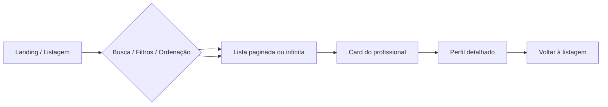

# PRD — Fatal Trainer

**Produto:** Plataforma web de catálogo e descoberta de **personal trainers** autônomos  
**Contexto:** Desafio técnico Front-end — Atlas Technologies  
**Stack obrigatória:** Vue 3, Nuxt, TypeScript  
**Versão do documento:** 1.2  
**Status:** Em implementação  

**Documentos relacionados:**
- [Requisitos funcionais](./requisitos-funcionais.md)
- [Casos de uso](./casos-de-uso.md)
- [Requisitos não funcionais](./requisitos-nao-funcionais.md)
- [PRD de Design](./prd-design.md)
- [Especificação de componentes FT](./arquitetura/especificacao-componentes-ft.md)
---

## 1. Resumo executivo

### 1.1 Problema

Pessoas que buscam **personal trainer** (presencial, online ou híbrido) enfrentam dificuldade para comparar especialidades, preços por sessão, avaliações, modalidade de atendimento e proximidade — especialmente no mobile, onde a decisão costuma ser rápida.

### 1.2 Solução proposta

**Fatal Trainer** é uma aplicação web responsiva (mobile first) que lista **no mínimo 500 personal trainers**, permite busca por nome ou especialidade, filtros (preço, modalidade, avaliação, etc.), ordenação, carregamento sob demanda e **perfil detalhado** ao selecionar um trainer.
### 1.3 Objetivo do produto (para o teste)

Demonstrar capacidade de:

- priorizar escopo com critério (MVP sólido > feature sprawl);
- entregar UX clara em mobile e desktop;
- organizar código front-end de forma mantível;
- tomar decisões técnicas defensáveis (performance, TypeScript, Nuxt).

### 1.4 Métricas de sucesso (avaliação)

| Dimensão | Indicador de sucesso |
|----------|---------------------|
| Funcional | Todos os requisitos **Must** atendidos e verificáveis |
| UX | Fluxo listagem → detalhe fluido em mobile e desktop |
| Técnico | Código componentizado, tipado e documentado no README |
| Performance | Consciência explícita de Web Vitals no README (mesmo sem otimização extrema) |
| Entrega | Repo público, deploy, vídeo ≤ 5 min, formulário preenchido |

---

## 2. Contexto e escopo

### 2.1 Fora de escopo (explícito)

- Autenticação, cadastro de profissionais ou painel administrativo
- Pagamento, agendamento real ou integração com backends de produção
- Soluções no-code / low-code como entrega principal
- Implementar **todas** as melhorias opcionais listadas no desafio

### 2.2 Premissas

- Dados podem ser **locais (JSON)** ou via API mock; não há backend obrigatório
- Segmento definido: **personal trainers** (musculação, funcional, CrossFit, emagrecimento, HIIT, etc.)
- Uso de IA é permitido; deve ser declarado no README
- Fork do repositório base: [atlastechnol/atlas-frontend-challenge](https://github.com/atlastechnol/atlas-frontend-challenge)

### 2.3 Restrições

- Base em **Vue 3 + Nuxt + TypeScript**
- Mínimo **500 registros** de profissionais
- Entrega: repositório, deploy, vídeo explicativo, [formulário](https://forms.gle/CCCnwtNzipEgFv7M9)

---

## 3. Visão de produto e posicionamento

### 3.1 Proposta de valor

> “Encontre o personal trainer ideal para o seu objetivo — emagrecer, ganhar massa ou treinar funcional — com preço transparente, avaliações e modalidade clara, direto no celular.”

### 3.2 Segmento (decisão de produto)

**Segmento:** catálogo de **personal trainers autônomos**.

**Especialidades previstas no dataset:**

| Categoria | Exemplos |
|-----------|----------|
| Objetivo | Emagrecimento, hipertrofia, condicionamento |
| Modalidade de treino | Musculação, Funcional, CrossFit, HIIT, Pilates |
| Público | Iniciantes, idosos, gestantes, atletas |
| Formato | Presencial (academia/domícilio), online ao vivo, híbrido |

**Justificativa:** campos naturais para preço por sessão, avaliação, distância, especialidades, CREF e disponibilidade; alta demanda no mercado fitness brasileiro; nome do projeto (**Fatal Trainer**) reforça identidade do produto.

### 3.3 Personas

| Persona | Necessidade | Comportamento esperado |
|---------|-------------|------------------------|
| **Marina (28)** — mobile, quer emagrecer | Personal funcional perto de casa, preço acessível | Filtra por especialidade + distância, ordena por avaliação, UC-03/UC-06 |
| **Carlos (45)** — desktop, retorno aos treinos | Comparar musculação vs. funcional, ver CREF e preço | Ordena por preço, lê bio e certificações no perfil, UC-04/UC-06 |
| **Julia (22)** — online | Trainer para treino remoto | Filtra modalidade "Online", busca por "HIIT" |
---

## 4. Jornada do usuário



### 4.1 Fluxo principal (happy path)

1. Usuário abre a aplicação e vê cards de profissionais (primeiro lote carregado sob demanda).
2. Digita na busca (nome ou profissão) e/ou aplica filtros e ordenação.
3. Lista atualiza mantendo performance (virtualização ou paginação).
4. Toca/clica em um card → navega para `/personal-trainers/[id]`.
5. Lê bio, preço da sessão, especialidades, modalidade e avaliações.
6. Retorna à listagem com busca/filtros preservados na URL (UC-07).
---

## 5. Requisitos funcionais e casos de uso

Os requisitos detalhados e casos de uso estão em documentos dedicados:

| Documento | Conteúdo |
|-----------|----------|
| [requisitos-funcionais.md](./requisitos-funcionais.md) | RF-001 a RF-013, regras de negócio, critérios de aceite |
| [casos-de-uso.md](./casos-de-uso.md) | UC-01 a UC-07, fluxos principal/alternativo/exceção, jornadas |

### 5.1 Resumo por épico

**E1 — Catálogo (listagem)** → RF-001 a RF-006, RF-012  
**E2 — Perfil do personal trainer** → RF-007 a RF-009, RF-013  
**E3 — Dados** → RF-010, RF-011  

### 5.2 Mapa épico → caso de uso

| Épico | Casos de uso |
|-------|--------------|
| E1 | UC-01, UC-02, UC-03, UC-04, UC-05 |
| E2 | UC-06, UC-07 |
| E3 | (suporte transversal a todos os UC) |
---

## 6. Modelo de dados

```typescript
interface PersonalTrainer {
  id: string;
  name: string;
  profession: string;           // ex.: "Personal Trainer — CrossFit"
  description: string;        // bio, abordagem, objetivos atendidos
  photoUrl: string;
  servicePrice: number;       // preço por sessão/aula (BRL)
  rating?: number;            // 0–5
  reviewCount?: number;
  distanceKm?: number;
  city?: string;
  state?: string;
  specialties?: string[];     // Musculação, Funcional, Emagrecimento...
  modalities?: ('presencial' | 'online' | 'hibrido')[];
  cref?: string;              // ex.: "012345-G/SP"
  gallery?: string[];
  availability?: string;      // ex.: "Seg–Sex, 6h–21h"
  experienceYears?: number;
  reviews?: { author: string; rating: number; comment: string }[];
}

interface ListQuery {
  search?: string;
  specialties?: string[];
  modalities?: string[];
  minPrice?: number;
  maxPrice?: number;
  minRating?: number;
  city?: string;
  maxDistanceKm?: number;
  sortBy: 'price' | 'rating' | 'distance' | 'name';
  sortOrder: 'asc' | 'desc';
  page: number;
  pageSize: number;
}
```

**Volume:** ≥ 500 objetos `PersonalTrainer` com especialidades e modalidades variadas.
---

## 7. Experiência do usuário (UX/UI)

### 7.1 Princípios

- **Mobile first:** controles de busca/filtro acessíveis com o polegar; cards em coluna única no mobile
- **Clareza:** hierarquia visual — nome > especialidade > preço/sessão > avaliação > modalidade
- **Performance percebida:** skeletons, transições leves, evitar layout shift em imagens (`width`/`height` ou aspect-ratio)

### 7.2 Decisões de UX recomendadas (defensáveis)

| Decisão | Escolha sugerida | Alternativa | Motivo |
|---------|------------------|-------------|--------|
| Detalhe do trainer | **Página dedicada** (`/personal-trainers/[id]`) | Modal / drawer | SEO, URL compartilhável, deep link |
| Listagem | **Scroll infinito** + sentinel | Paginação numérica | Alinha com catálogos mobile; combinar com virtualização se necessário |
| Filtros mobile | **Bottom sheet** ou painel colapsável | Sidebar fixa | Espaço em telas pequenas |
| Filtros desktop | Barra lateral ou chips no topo | — | Descoberta rápida |
| Busca | Campo fixo no topo com ícone | — | Padrão de marketplace |

### 7.3 Wireframes conceituais

**Mobile — listagem**

```
┌─────────────────────────┐
│ [🔍 Buscar...]          │
│ Filtros ▾  Ordenar ▾    │
├─────────────────────────┤
│ ┌─────┐ Ana Silva       │
│ │ foto│ Funcional       │
│ └─────┘ R$ 120/sessão ★4.8│
├─────────────────────────┤
│        (mais cards)     │
│         ···             │
└─────────────────────────┘
```

**Desktop — listagem**

```
┌──────────┬──────────────────────────────────┐
│ Filtros  │ Busca + Ordenação                │
│          ├──────────────────────────────────┤
│ Preço    │ [card] [card] [card]             │
│ Especial.│ [card] [card] [card]             │
│ Modalid. │        ...                       │
└──────────┴──────────────────────────────────┘
```

---

## 8. Arquitetura técnica (alto nível)

### 8.1 Stack

| Camada | Tecnologia |
|--------|------------|
| Framework | **Nuxt 4** (Vue 3, Composition API, file-based routing) |
| Linguagem | **TypeScript** (strict recomendado) |
| UI / estilo | **Tailwind CSS** + **Nuxt UI** |
| Testes unitários | **Vitest** + `@vue/test-utils` |
| Testes E2E | **Cypress** |
| Documentação UI | **Storybook** |
| Dados | `server/api/personal-trainers` + composables |
| Deploy | Vercel, Netlify, Cloudflare Pages ou similar |

Detalhamento completo: [requisitos-nao-funcionais.md](./requisitos-nao-funcionais.md) (RNF-005 a RNF-011).
### 8.2 Estrutura de pastas sugerida

```
├── components/
│   ├── trainer/
│   │   ├── TrainerCard.vue
│   │   ├── TrainerList.vue
│   │   └── TrainerFilters.vue
│   └── ui/
├── composables/
│   ├── usePersonalTrainers.ts
│   └── useTrainerFilters.ts
├── types/
│   └── personal-trainer.ts
├── pages/
│   ├── index.vue
│   └── personal-trainers/[id].vue
├── server/api/
│   └── personal-trainers.get.ts
├── public/data/
└── docs/
    ├── PRD.md
    ├── requisitos-funcionais.md
    ├── requisitos-nao-funcionais.md
    ├── casos-de-uso.md
    └── ADR.md
```

### 8.3 Ferramentas de qualidade

| Ferramenta | Propósito | Script |
|------------|-----------|--------|
| Vitest | Composables, utils, componentes | `pnpm test` |
| Cypress | Jornadas E2E (UC-01 → UC-07) | `pnpm test:e2e` |
| Storybook | Stories de `TrainerCard`, filtros, listas | `pnpm storybook` |
| ESLint | Padrões de código | `pnpm lint` |

### 8.4 Responsabilidades

- **Pages:** composição de layout e SEO
- **Composables:** lógica de listagem, query sync com URL (`useRoute` / `useRouter`)
- **Components:** apresentação pura; props tipadas
- **Types:** contrato único do domínio
- **Server (opcional):** paginação e filtro no servidor para simular API real

### 8.5 Bibliotecas auxiliares (Could — justificar se usar)

| Biblioteca | Uso | Risco se omitir |
|------------|-----|-----------------|
| `@vueuse/core` | debounce, infinite scroll, media queries | Reinventar utilitários |
| `fuse.js` | busca fuzzy client-side em 500 itens | Busca apenas `includes` — aceitável no MVP |
| `@tanstack/vue-virtual` | virtualizar lista longa | Mais reflow sem virtualização |

---

## 9. Requisitos não funcionais

Documento completo: [requisitos-nao-funcionais.md](./requisitos-nao-funcionais.md)

### 9.1 Resumo por categoria

| Categoria | RNF principais | Prioridade |
|-----------|----------------|------------|
| Performance | RNF-001, RNF-002 (Web Vitals) | Must / Should |
| Responsividade | RNF-003 (Tailwind mobile first) | Must |
| Acessibilidade | RNF-004 (Nuxt UI + teclado) | Should |
| Stack | RNF-005 Nuxt 4, RNF-006 Vue+TS, RNF-007 Tailwind, RNF-008 Nuxt UI | Must |
| Testes | RNF-009 Vitest, RNF-010 Cypress, RNF-011 Storybook | Should |
| Operação | RNF-012 build/deploy, RNF-013 SEO | Must / Should |
| Código | RNF-014 manutenibilidade, RNF-015 segurança | Must / Should |

### 9.2 Metas de performance (referência)

| Aspecto | Meta orientativa |
|---------|------------------|
| LCP | ≤ 2,5 s (mobile) |
| INP | ≤ 200 ms |
| CLS | ≤ 0,1 |
| Listagem | Lotes de 12–24; não 500 cards no DOM |

Trade-offs documentados no **README**.
---

## 10. Priorização de entrega (roadmap)

### Fase 1 — MVP entregável (Must)

1. Scaffold **Nuxt 4** + TypeScript + Tailwind + Nuxt UI  
2. Dataset 500+ personal trainers + tipos  
3. Página inicial com cards, busca, ≥1 filtro, ≥2 ordenações  
4. Carregamento sob demanda (paginação ou infinite scroll)  
5. Página de detalhe com campos obrigatórios  
6. Responsividade mobile first  
7. README completo + deploy + vídeo  

**Estimativa orientativa:** 2–4 dias de trabalho focado.

### Fase 2 — Qualidade percebida (Should)

- Skeletons (Nuxt UI `USkeleton`), empty states, filtros na URL  
- Bloco complementar no perfil (especialidades, CREF, galeria ou avaliações)  
- SEO meta nas páginas  
- Lazy loading e otimização básica de imagens  
- **Vitest:** composables de busca/filtro/ordenação  
- **Storybook:** stories de `TrainerCard`, `TrainerFilters`, `TrainerList`

### Fase 3 — Diferenciais (Could)

- **Cypress:** specs E2E completos (UC-01 a UC-07)  
- Docker para dev  
- Virtualização da lista  
- i18n, tema escuro, favoritos em `localStorage`  
- ADRs em `docs/ADR.md`
---

## 11. Critérios de aceite globais (checklist de entrega)

### Funcional

- [ ] ≥ 500 personal trainers no catálogo  
- [ ] Listagem com foto, nome, especialidade, valor/sessão  
- [ ] Busca por nome **ou** profissão funcionando  
- [ ] Filtragem aplicável e combinável com busca  
- [ ] Ordenação por ≥ 2 critérios  
- [ ] Carregamento incremental (não 500 cards no DOM de uma vez)  
- [ ] Perfil com foto, nome, profissão, descrição, valor  
- [ ] Layout responsivo mobile e desktop  

### Técnico

- [ ] Nuxt 4 + Vue 3 + TypeScript  
- [ ] Tailwind CSS + Nuxt UI  
- [ ] Componentização e separação de responsabilidades evidentes  
- [ ] Vitest configurado (`pnpm test`) — Should  
- [ ] Cypress E2E jornada principal — Should  
- [ ] Storybook com componentes principais — Should  
- [ ] README com setup, decisões, uso de IA (se houver)  
- [ ] Código em repositório próprio (fork do desafio)
### Entrega externa

- [ ] Link do repositório no [formulário](https://forms.gle/CCCnwtNzipEgFv7M9)  
- [ ] Link da aplicação publicada  
- [ ] Vídeo ≤ 5 min explicando solução e decisões  

---

## 12. Riscos e mitigações

| Risco | Impacto | Mitigação |
|-------|---------|-----------|
| JSON de 500+ itens inflar o bundle | LCP ruim | Servir via API Nuxt com paginação; ou chunk lazy do JSON |
| Scroll infinito sem virtualização | Scroll pesado | Limitar itens no DOM; virtualizar na Fase 3 |
| Scope creep (muitos filtros/features) | Atraso / qualidade baixa | Seguir roadmap Fase 1 primeiro |
| Imagens externas quebradas | UX ruim | Placeholder local + fallback `onerror` |
| Over-engineering de estado | Complexidade | URL query + composables antes de Pinia |

---

## 13. Plano de testes (manual)

| Cenário | Passos | Resultado esperado |
|---------|--------|-------------------|
| Listagem inicial | Abrir `/` | Primeiro lote de cards visível rapidamente |
| Busca | Buscar nome parcial | Lista filtrada; empty state se zero |
| Filtro + sort | Aplicar filtro e ordenar por preço | Ordem correta; contador coerente |
| Infinite scroll | Rolar até o fim | Novos cards carregam sem travar |
| Detalhe | Clicar card | Perfil com todos campos Must |
| Deep link | Abrir `/personal-trainers/{id}` direto | Perfil renderiza |
| Mobile | DevTools 375px | Sem scroll horizontal; filtros usáveis |
| Performance | Lighthouse (mobile) | Registrar scores no README |

---

## 14. Documentação esperada (README)

O README da entrega deve funcionar como onboarding de time. Mínimo:

1. **Como executar** — `pnpm install`, `pnpm dev`, `pnpm build`  
2. **Decisões técnicas** — dados, roteamento, paginação, estilos  
3. **Performance** — o que foi feito para Web Vitals  
4. **Uso de IA** — ferramentas e como foram usadas  
5. **Melhorias futuras** — backlog pós-MVP  
6. **Estrutura do projeto** — mapa breve de pastas  

---

## 15. Roteiro para vídeo de entrega (≤ 5 min)

1. **0:00–0:30** — Fatal Trainer: catálogo de personal trainers, visão do produto  
2. **0:30–2:00** — Demo mobile: busca, filtros, scroll, perfil  
3. **2:00–3:00** — Demo desktop + destaque de responsividade  
4. **3:00–4:00** — Tour rápido no código (pastas, composables, dados)  
5. **4:00–5:00** — Performance, priorização, o que ficou de fora e por quê  

---

## 16. Glossário

| Termo | Definição |
|-------|-----------|
| Personal trainer | Profissional de educação física autônomo listado no catálogo |
| Sessão / aula | Unidade de cobrança (`servicePrice`) |
| Especialidade | Foco do treino (funcional, musculação, emagrecimento, etc.) |
| Modalidade | Presencial, online ou híbrido |
| CREF | Registro profissional no Conselho Regional de Educação Física |
| Card | Unidade visual na listagem com resumo |
| Must/Should/Could | Priorização MoSCoW |
---

## 17. Histórico de revisões

| Versão | Data | Alterações |
|--------|------|------------|
| 1.0 | 2026-06-04 | Versão inicial do PRD |
| 1.1 | 2026-06-04 | Segmento personal trainer; RF e UC em docs dedicados |
| 1.2 | 2026-06-04 | Stack Nuxt 4, Vitest, Cypress, Storybook, Tailwind, Nuxt UI; RNF dedicado |---

## Apêndice A — Mapeamento desafio → PRD

| Requisito do desafio (`docs/challenge.md`) | Seção PRD |
|---------------------------------------------|-----------|
| Listagem 500+ | E1.2, §6, §10 Fase 1 |
| Campos do card | E1.3 |
| Busca, filtro, ordenação | E1.4–E1.6 |
| Carregamento sob demanda | E1.7, §9.1 |
| Perfil detalhado | E2, §7.2 |
| Vue/Nuxt/TS | §8 |
| Performance / README | §9, §14 |
| Opcionais | §10 Fase 3, §9.2 |
| Entrega formulário + vídeo | §11, §15 |

---

## Apêndice B — Backlog de ideias (pós-MVP)

- Comparar até 3 personal trainers lado a lado  
- Filtro por objetivo (emagrecer, hipertrofia, condicionamento)  
- Mapa com academias/bairros de atendimento  
- Calculadora de pacotes (4, 8, 12 sessões)  
- Compartilhar perfil (Web Share API)  
- Favoritos em `localStorage`  
- Testes E2E com Playwright (UC-01 → UC-06)  