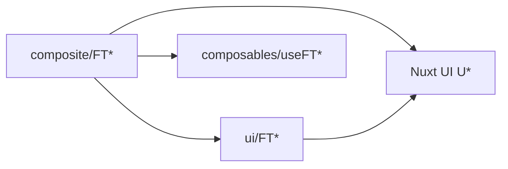

# Especificação — Biblioteca de componentes FT

**Versão:** 1.0  
**Status:** Normativo  
**Documentos base:** [estrutura-pastas.md](./estrutura-pastas.md) · [prd-design.md](../prd-design.md) · [design/fatal-trainer.pen](../../design/fatal-trainer.pen)

---

## 1. Objetivo

Este documento define **como criar, organizar e manter** os componentes da interface Fatal Trainer:

- convenções de nomenclatura e pastas;
- diferença entre primitivos (`ui/`) e compostos (`composite/`);
- arquivos obrigatórios (Vue, testes, Storybook);
- sincronização obrigatória com o design em Pencil (`.pen`).

Qualquer componente novo ou alterado no projeto deve seguir esta especificação.

---

## 2. Nomenclatura

| Regra | Detalhe |
|-------|---------|
| Prefixo | Sempre `FT` + nome em PascalCase (`FTAvatar`, `FTTrainerCard`) |
| Código | Inglês (props, composables, pastas) |
| Texto visível | Português (labels, mensagens, placeholders) |
| Pasta | Mesmo nome do componente: `FTAvatar/FTAvatar.vue` |
| Auto-import Nuxt | Nome do componente = nome da pasta (`FTAvatar`), sem prefixo `Ui` — ver `nuxt.config.ts` (`pathPrefix: false`) |

---

## 3. Onde colocar cada componente

### 3.1 Primitivos — `app/components/ui/`

**Critério:** um único papel visual; dados via **props**; **não** importa outros componentes `FT*` (pode usar Nuxt UI e utilitários).

| Exemplos | Papel |
|----------|--------|
| `FTAvatar` | Avatar / iniciais |
| `FTIconButton` | Botão ícone (ação ou link) |
| `FTPriceLabel`, `FTRatingBadge`, `FTStarRating` | Preço e avaliação |
| `FTModalityBadge`, `FTDistanceLabel` | Badge e metadado |
| `FTSearchInput` | Campo de busca |
| `FTActiveFilterChip` | Chip removível |
| `FTSectionHeading`, `FTProfileSection` | Título e bloco de seção |
| `FTResultsCounter`, `FTLoadMoreSentinel` | Contador e rodapé de loading |
| `FTTrainerCardSkeleton` | Placeholder de skeleton |
| `FTBackLink` | Navegação voltar |
| `FTGradientBubbles` | Decoração de fundo |

### 3.2 Compostos — `app/components/composite/`

**Critério:** monta **um ou mais** primitivos `FT*` e/ou orquestra estado com composable `useFT*` (API, URL, filtros).

| Subpasta | Exemplos |
|----------|----------|
| `common/` | `FTEmptyState`, `FTErrorState` |
| `catalog/` | `FTTrainerCard`, `FTTrainerList`, `FTFilterPanel`, `FTCatalogToolbar`, … |
| `profile/` | `FTProfileHeader`, `FTProfileHero`, `FTProfileGallery`, … |

### 3.3 Regra de dependência



- **Permitido:** `composite/**` → `ui/**`, `composables/components/useFT*`, Nuxt UI.
- **Proibido:** `ui/**` → `composite/**`.
- **Proibido:** lógica de negócio pesada ou `$fetch` direto em `.vue` de UI; usar composables.

---

## 4. Estrutura de arquivos (obrigatória)

Cada componente FT vive em **sua própria pasta**, com **três arquivos** de mesmo nome:

```
app/components/{ui|composite}/<contexto>/FT<Nome>/
  FT<Nome>.vue           # Single File Component
  FT<Nome>.spec.ts       # Testes unitários (Vitest)
  FT<Nome>.stories.ts    # Documentação visual (Storybook)
```

| Arquivo | Responsabilidade |
|---------|------------------|
| `FT<Nome>.vue` | Template + script setup; tipagem TypeScript |
| `FT<Nome>.spec.ts` | Comportamento e render mínimo; usar `tests/helpers/mount-ft.ts` quando precisar de mount |
| `FT<Nome>.stories.ts` | Variantes visuais; título `UI/...` ou `Composite/<Contexto>/...` |

**Composables de composite** (quando houver orquestração):

```
app/composables/components/useFT<Nome>.ts
```

- Prefixo `useFT` alinhado ao componente (`useFTTrainerList` ↔ `FTTrainerList`).
- Composables de **domínio** (`usePersonalTrainers`, `useTrainerFilters`) permanecem em `app/composables/catalog/` ou `profile/`; `useFT*` apenas encapsula uso na UI.

---

## 5. Implementação — primitivos (UI)

### 5.1 Padrão SFC

```vue
<script setup lang="ts">
const props = withDefaults(defineProps<{
  label: string
  size?: 'sm' | 'md'
}>(), {
  size: 'md',
})

const emit = defineEmits<{
  click: []
}>()
</script>

<template>
  <!-- Tailwind + Nuxt UI; tokens em app/assets/css/theme.css -->
</template>
```

### 5.2 Regras

| Regra | Detalhe |
|-------|---------|
| Dados | Sempre **props** tipadas; `emit` para interação |
| Estado | Apenas `computed` local derivado de props |
| Nuxt UI | Preferir primitivos `UButton`, `UInput`, `UBadge`, `UAvatar`, etc. |
| Estilo | Tailwind + classes globais (`.btn-icon-surface`, `.search-pill`, …) |
| A11y | `aria-label`, roles e `data-testid` kebab-case quando aplicável |
| i18n | Strings visíveis em português no template |

### 5.3 Testes (UI)

- Cobrir render com props default e pelo menos uma variante relevante.
- Exemplo: `FTPriceLabel` deve exibir `R$` e texto "por sessão".

### 5.4 Storybook (UI)

- `title`: `UI/FT<Nome>` (ex.: `UI/FTAvatar`).
- Mínimo: story `Default` + uma variante de borda (estado vazio, tamanho grande, texto longo, etc.).

---

## 6. Implementação — compostos (Composite)

### 6.1 Padrão SFC

```vue
<script setup lang="ts">
const { trainers, pending, isEmpty, clearFilters } = useFTTrainerList()
</script>

<template>
  <FTEmptyState v-if="isEmpty" ... />
  <FTTrainerCard v-for="t in trainers" :key="t.id" :trainer="t" />
</template>
```

### 6.2 Regras

| Regra | Detalhe |
|-------|---------|
| Dados | Preferir **composable `useFT*`** no `setup`; evitar props para payload de API |
| Props permitidas | Apenas wiring: `mode`, flags de layout, `id` de rota quando inevitável |
| Composição | Montar primitivos `ui/FT*`; não duplicar markup de primitivos inline |
| Pages | Páginas finas: importam composites; sem `watch` de filtros/API na page se já estiver no `useFT*` |

### 6.3 Testes (Composite)

- Spec mínimo: componente e composable exportados/definidos.
- Quando possível: testar composable em `tests/unit/composables/` com mocks de rota/fetch.
- Estados críticos (loading, empty, error) devem ter stories dedicadas.

### 6.4 Storybook (Composite)

- `title`: `Composite/<Contexto>/FT<Nome>` (ex.: `Composite/Catalog/FTTrainerList`).
- Decorator fullscreen (já configurado em `.storybook/preview.ts` para `Composite/*`).

---

## 7. Stack e tokens

| Camada | Uso |
|--------|-----|
| **Nuxt UI v3+** | Base acessível; não fazer fork de componentes inteiros |
| **Tailwind CSS v4** | Utilitários; `@import "tailwindcss"` em `app/assets/css/main.css` |
| **Tokens** | `app/assets/css/theme.css`, `app.config.ts`; paleta em [prd-design.md](../prd-design.md) §3 |
| **Ícones** | Lucide via Nuxt Icon (`i-lucide-*`) |

---

## 8. Sincronização código ↔ design (`.pen`)

O arquivo **[design/fatal-trainer.pen](../../design/fatal-trainer.pen)** é o mockup hi-fi oficial (Pencil). **Código e `.pen` devem permanecer alinhados.**

### 8.1 Princípio

> **Toda criação ou alteração de componente FT exige atualização nos dois lugares:** implementação Vue **e** representação no `.pen` (e vice-versa).

Não existe “só código” nem “só design” para componentes da biblioteca FT.

### 8.2 Fluxo A — Componente criado no código primeiro

1. Implementar em `app/components/ui/` ou `composite/` conforme §3, com `.vue`, `.spec.ts`, `.stories.ts`.
2. Abrir `design/fatal-trainer.pen` no **Pencil** (não editar o `.pen` como texto).
3. Criar ou atualizar o nó **reusable** com o **mesmo nome** (`FTAvatar`, `FTTrainerCard`, …).
4. Aplicar tokens do [prd-design.md](../prd-design.md) (cores, tipografia, espaçamento).
5. Posicionar o componente nas telas afetadas (T-01 catálogo, T-02 perfil, etc.).
6. Validar visualmente: Storybook ↔ screenshot do Pencil.
7. Commitar **código + `.pen`** no mesmo PR sempre que possível.

### 8.3 Fluxo B — Componente criado no `.pen` primeiro

1. Desenhar o componente reusable no Pencil com nome `FT<Nome>`.
2. Criar a pasta e os três arquivos no repositório conforme §4.
3. Implementar seguindo §5 ou §6 e [prd-design.md](../prd-design.md) §4 (anatomia).
4. Adicionar stories cobrindo variantes desenhadas no `.pen`.
5. Commitar **`.pen` + código** juntos.

### 8.4 Fluxo C — Alteração em componente existente

| Onde mudou primeiro | Ação obrigatória |
|---------------------|------------------|
| Código (props, layout, cor) | Atualizar instância/reusable no `.pen` |
| `.pen` (visual, spacing) | Atualizar `FT<Nome>.vue` e stories |
| Ambos | Manter nomes `FT*` idênticos; revisar dependentes (composites que usam o primitivo) |

### 8.5 Convenções no Pencil

| Aspecto | Convenção |
|---------|-----------|
| Nome do reusable | Igual ao componente Vue: `FTAvatar`, `FTTrainerCard` |
| Variantes | Refletir stories do Storybook (default, empty, loading, etc.) |
| Telas | Frames T-01, T-02 conforme [prd-design.md](../prd-design.md) §2 |
| Regeneração em lote | `node design/generate-pen.mjs` — ver [design/README.md](../../design/README.md); não substitui ajuste fino manual no Pencil |
| Leitura programática | Usar **Pencil MCP** no editor; **não** abrir `.pen` com `Read`/grep (formato criptografado) |

### 8.6 Checklist de sincronização (obrigatório no PR)

- [ ] Componente `FT<Nome>` existe em `ui/` ou `composite/` com `.vue`, `.spec.ts`, `.stories.ts`
- [ ] Reusable ou instância correspondente existe em `design/fatal-trainer.pen`
- [ ] Nome idêntico entre código e Pencil
- [ ] Storybook atualizado (variantes novas)
- [ ] `npm test` e `npm run typecheck` passando
- [ ] Se aplicável: `useFT*` criado/atualizado em `app/composables/components/`

---

## 9. Checklist — novo componente FT

### Decisão inicial

- [ ] É primitivo (um papel, só props)? → `app/components/ui/FT<Nome>/`
- [ ] Compõe outros `FT*` ou usa API/URL? → `app/components/composite/<contexto>/FT<Nome>/`

### Arquivos

- [ ] `FT<Nome>.vue` (script setup + template)
- [ ] `FT<Nome>.spec.ts`
- [ ] `FT<Nome>.stories.ts`
- [ ] `useFT<Nome>.ts` se for composite com orquestração

### Qualidade

- [ ] Props/composable tipados; sem `any`
- [ ] Texto de UI em português
- [ ] `data-testid` estável se usado em E2E
- [ ] Dependência `ui` → `composite` respeitada

### Design

- [ ] Reusable `FT<Nome>` no `fatal-trainer.pen` criado ou atualizado
- [ ] Visual conferido com [prd-design.md](../prd-design.md)

---

## 10. Inventário de referência (v1.0)

### Primitivos (`ui/`)

`FTActiveFilterChip`, `FTAvatar`, `FTBackLink`, `FTDistanceLabel`, `FTGradientBubbles`, `FTIconButton`, `FTLoadMoreSentinel`, `FTModalityBadge`, `FTPriceLabel`, `FTProfileSection`, `FTRatingBadge`, `FTResultsCounter`, `FTSearchInput`, `FTSectionHeading`, `FTStarRating`, `FTTrainerCardSkeleton`

### Compostos (`composite/`)

| Contexto | Componentes |
|----------|---------------|
| `common/` | `FTEmptyState`, `FTErrorState` |
| `catalog/` | `FTAppHeader`, `FTActiveFilterChips`, `FTCatalogToolbar`, `FTFilterFab`, `FTFilterPanel`, `FTSortSelect`, `FTTrainerCard`, `FTTrainerList` |
| `profile/` | `FTProfileCta`, `FTProfileGallery`, `FTProfileHeader`, `FTProfileHero`, `FTProfileLocationRow`, `FTProfileReviewList` |

---

## 11. Histórico

| Versão | Data | Alterações |
|--------|------|------------|
| 1.0 | 2026-06-04 | Versão inicial — UI vs composite, arquivos obrigatórios, sync `.pen` ↔ código |
