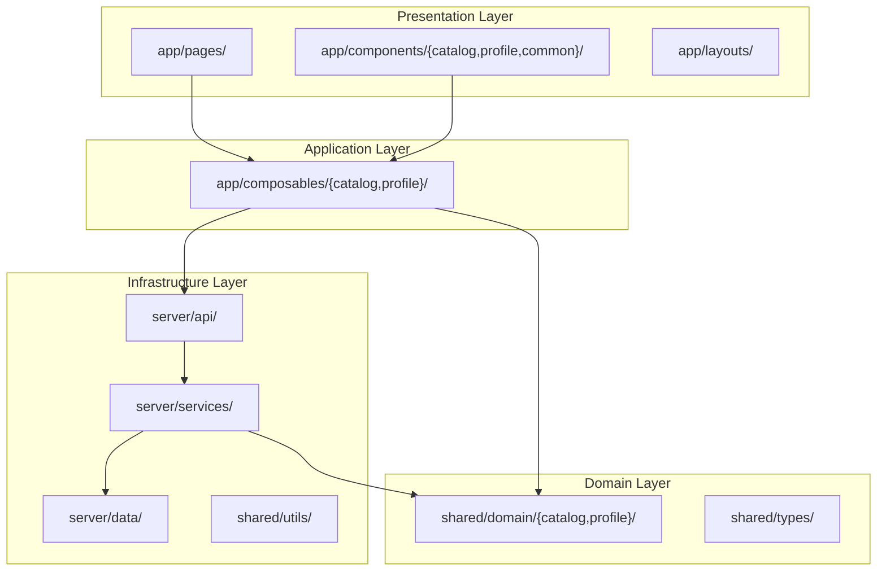
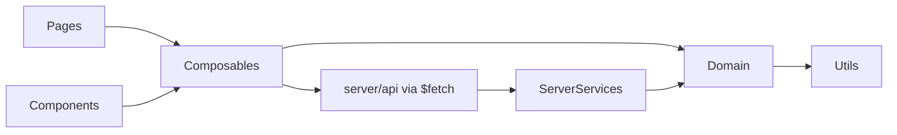

# Estrutura de Pastas — Fatal Trainer

**Versão:** 1.0  
**Stack:** Nuxt 4 + Vue 3 + TypeScript + DDD-lite  
**Documentos base:** [PRD.md](../PRD.md) · [requisitos-nao-funcionais.md](../requisitos-nao-funcionais.md) · [especificacao-componentes-ft.md](./especificacao-componentes-ft.md)

---

## 1. Objetivo e escopo

Este documento define a **estrutura de pastas** do front-end Fatal Trainer, alinhando:

- **Convenções nativas do Nuxt 4** (`app/`, `shared/`, `server/`) — RNF-005
- **Domain-Driven Design lite** no front-end — camadas claras sem over-engineering — RNF-006, RNF-014
- **Testabilidade** com pastas dedicadas para Vitest, Cypress e Storybook — RNF-009 a RNF-011

### 1.1 Divergência em relação ao PRD §8.2

O PRD original propõe estrutura plana (estilo Nuxt 3). Este projeto adota o **layout nativo do Nuxt 4**, onde `app/` é o `srcDir` padrão e `shared/` contém código reutilizado entre client e server.

| PRD §8.2 | Nuxt 4 (adotado) |
|----------|------------------|
| `components/` na raiz | `app/components/` |
| `composables/` na raiz | `app/composables/` |
| `types/` na raiz | `shared/domain/` + `shared/types/` |
| `pages/` na raiz | `app/pages/` |
| — | `shared/` (client + server) |

---

## 2. Bounded contexts

Derivados dos módulos funcionais (RF §2):

| Contexto | Módulo RF | Casos de uso | Responsabilidade |
|----------|-----------|--------------|------------------|
| **Catalog** | M1 | UC-01 a UC-05 | Listagem, busca, filtros, ordenação, paginação |
| **Profile** | M2 | UC-06, UC-07 | Visualização de perfil, navegação de retorno |
| **Shared Kernel** | M3 | (transversal) | Entidades, tipos, utilitários, contratos de API |

---

## 3. Camadas DDD → pastas Nuxt



| Camada DDD | Responsabilidade | Localização |
|------------|------------------|-------------|
| **Presentation** | UI, SEO, composição de layout | `app/pages/`, `app/components/`, `app/layouts/`, `app/app.vue` |
| **Application** | Orquestração de casos de uso, sync com URL | `app/composables/catalog/`, `app/composables/profile/` |
| **Domain** | Entidades, value objects, regras puras | `shared/domain/catalog/`, `shared/domain/profile/`, `shared/types/` |
| **Infrastructure** | API mock, persistência JSON, adapters | `server/api/`, `server/services/`, `server/mocks/`, `server/data/`, `shared/utils/` |

---

## 4. Árvore de diretórios

```
fatal-trainer/
├── app/                              # srcDir Nuxt 4 (RNF-005)
│   ├── assets/css/
│   │   └── main.css
│   ├── components/
│   │   ├── ui/                       # Primitivos FT* (Avatar, Button, Badge, Input…)
│   │   │   ├── FTAvatar/
│   │   │   ├── FTIconButton/
│   │   │   └── FTPriceLabel/
│   │   └── composite/                # Compostos FT* (usam ui/ + composables)
│   │       ├── common/               # FTEmptyState, FTErrorState
│   │       ├── catalog/              # FTTrainerCard, FTTrainerList, …
│   │       └── profile/              # FTProfileHeader, FTProfileHero, …
│   ├── composables/
│   │   ├── catalog/                  # domínio (API, URL)
│   │   │   ├── usePersonalTrainers.ts
│   │   │   └── useTrainerFilters.ts
│   │   ├── components/               # orquestração por composite
│   │   │   └── useFTTrainerList.ts
│   │   └── profile/
│   │       └── useTrainerProfile.ts
│   ├── layouts/
│   │   └── default.vue
│   ├── pages/
│   │   ├── index.vue
│   │   └── personal-trainers/
│   │       └── [id].vue
│   ├── app.vue
│   ├── app.config.ts
│   └── error.vue
├── shared/
│   ├── domain/
│   │   ├── catalog/
│   │   │   ├── entities/
│   │   │   │   └── personal-trainer.ts
│   │   │   ├── value-objects/
│   │   │   │   └── list-query.ts
│   │   │   └── services/
│   │   │       ├── filter-trainers.ts
│   │   │       └── sort-trainers.ts
│   │   └── profile/
│   │       └── services/
│   │           └── format-trainer-meta.ts
│   ├── types/
│   │   └── api.ts
│   └── utils/
│       ├── format-price.ts
│       └── normalize-search.ts
├── server/
│   ├── api/
│   │   ├── personal-trainers.get.ts
│   │   └── personal-trainers/
│   │       └── [id].get.ts
│   ├── services/
│   │   └── trainer-repository.ts
│   ├── mocks/
│   │   ├── mock-photos.ts
│   │   └── trainer-factory.ts
│   └── data/
│       └── personal-trainers.json
├── tests/
│   ├── helpers/
│   │   ├── mount-ft.ts
│   │   └── mock-trainer.ts
│   ├── unit/
│   │   ├── domain/
│   │   └── composables/
│   └── setup.ts
├── cypress/
│   ├── e2e/
│   └── support/
├── .storybook/
├── docs/
│   └── arquitetura/
│       └── estrutura-pastas.md
├── public/
├── nuxt.config.ts
├── vitest.config.ts
├── cypress.config.ts
├── package.json
└── README.md
```

---

## 5. Regras de dependência



### Permitido

- `app/pages/` → `app/composables/`, `app/components/`
- `app/components/` → `app/composables/` (via props/events, não import direto de lógica)
- `app/composables/` → `shared/domain/`, `$fetch('/api/...')`
- `server/api/` → `server/services/` → `shared/domain/`
- `shared/domain/` → `shared/utils/`

### Proibido

- `shared/domain/` importar de `app/` ou `server/`
- Lógica de filtro/ordenação dentro de arquivos `.vue`
- Componentes com lógica de negócio pesada (mover para composables ou domain services)
- `any` em código de produção (RNF-006)

### Responsabilidades por artefato

| Artefato | Faz | Não faz |
|----------|-----|---------|
| **Pages** | Composição, SEO (`useSeoMeta`) | Filtro, sort, fetch direto |
| **Components** | Apresentação, props/emits tipados | Estado global, regras de negócio |
| **Composables** | Orquestração de UC, sync URL | Renderização |
| **Domain services** | Regras puras testáveis | HTTP, DOM, Vue reactivity |
| **Server services** | Leitura de dados, paginação | UI |

---

## 6. Convenções de nomenclatura

| Aspecto | Convenção | Exemplo |
|---------|-----------|---------|
| Código | Inglês | `usePersonalTrainers`, `filterTrainers` |
| UI (texto visível) | Português | "Encontre seu personal trainer" |
| UI (primitivo) | Prefixo `FT` em `app/components/ui/` | `ui/FTAvatar/`, `ui/FTIconButton/` |
| Composite | Prefixo `FT` em `app/components/composite/` | `composite/catalog/FTTrainerCard/` |
| Composite (dados) | Composable `useFT*` em `app/composables/components/` | `useFTTrainerList.ts` |
| Composables domínio | Prefixo `use` | `useTrainerFilters.ts` |
| Composables composite | Prefixo `useFT` | `useFTTrainerList.ts` |
| Server routes | kebab-case | `personal-trainers.get.ts` |
| Testes colocados | Sufixo `.spec.ts` na pasta do componente | `FTAvatar.spec.ts` |
| Stories colocados | Sufixo `.stories.ts` na pasta do componente | `FTAvatar.stories.ts` |
| data-testid | kebab-case | `data-testid="trainer-card"` |

### UI vs Composite

| Pasta | Critério | Exemplos |
|-------|----------|----------|
| `app/components/ui/` | Primitivo: um papel visual, props simples, sem compor outros FT* | `FTAvatar`, `FTIconButton`, `FTPriceLabel`, `FTSearchInput` |
| `app/components/composite/` | Composto: monta primitivos FT* e/ou `useFT*` (API, URL, estado) | `FTTrainerCard`, `FTTrainerList`, `FTEmptyState`, `FTProfileHeader` |

Regra de dependência: `composite/**` pode importar `ui/**`; `ui/**` não importa `composite/**`.

Detalhes completos (props, composables, testes, Storybook, sync com `.pen`): **[especificacao-componentes-ft.md](./especificacao-componentes-ft.md)**.

---

## 7. Auto-imports Nuxt

Por padrão, Nuxt 4 escaneia apenas composables no **top-level** de `app/composables/`. Composables aninhados por bounded context requerem configuração:

```ts
// nuxt.config.ts
export default defineNuxtConfig({
  imports: {
    dirs: ['composables/**'],
  },
})
```

| Pasta | Auto-import |
|-------|-------------|
| `app/components/` | Sim (incluindo subpastas) |
| `app/composables/**` | Sim (com `imports.dirs`) |
| `shared/utils/` | Sim |
| `shared/types/` | Sim |
| `shared/domain/` | Não — import via alias `#shared/domain/...` |
| `shared/types/` | Não — import via alias `#shared/types/...` |

### Alias `#shared`

Nuxt 4 expõe o alias `#shared/*` para imports entre `app/`, `server/` e `shared/`:

```ts
import type { PersonalTrainer } from '#shared/domain/catalog/entities/personal-trainer'
import { formatPrice } from '#shared/utils/format-price' // ou auto-import
```

Evite paths relativos (`../../../shared/...`) — quebram no build SSR.

---

## 8. Rastreabilidade RNF → estrutura

| RNF | Como a estrutura atende |
|-----|-------------------------|
| RNF-001 | Dados em `server/data/`; paginação via API; sem bundle de 500 itens |
| RNF-002 | Skeletons em components; `aspect-ratio` nos cards |
| RNF-003 | Tailwind mobile first em `app/components/` |
| RNF-004 | Semântica em `layouts/`, Nuxt UI primitivos |
| RNF-005 | `app/`, `pages/`, `server/api/` |
| RNF-006 | `shared/domain/`, composables tipados, `strict: true` |
| RNF-007 | Tailwind via `@nuxt/ui` |
| RNF-008 | `app/components/` compõe primitivos Nuxt UI |
| RNF-009 | `tests/unit/domain/`, `tests/unit/composables/` |
| RNF-010 | `cypress/e2e/` |
| RNF-011 | `.storybook/`, stories colocados em `app/components/**/` |
| RNF-012 | Scripts em `package.json` |
| RNF-013 | `useSeoMeta` em `app/pages/` |
| RNF-014 | Este documento + ESLint + README |

---

## 9. Histórico

| Versão | Data | Alterações |
|--------|------|------------|
| 1.0 | 2026-06-04 | Versão inicial — Nuxt 4 + DDD-lite |
| 1.1 | 2026-06-04 | Biblioteca FT — primitivos em `ui/`, compostos em `composite/`, stories/specs colocados |
| 1.2 | 2026-06-04 | [especificacao-componentes-ft.md](./especificacao-componentes-ft.md) — normas FT e sync `.pen` ↔ código |
