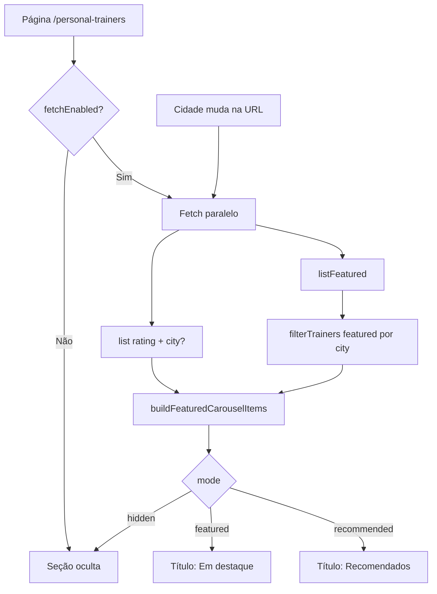

# Resumo da Branch — `refactor/enhance-trainers-page`

## Informações gerais

| Campo | Valor |
|-------|-------|
| **Branch** | `refactor/enhance-trainers-page` |
| **Repositório** | fatal-trainer (frontend Nuxt) |
| **Base** | `dev` (merge PR #5 — segregação por cidade) |
| **Objetivo** | Integrar o carrossel de destaque com o backend real, filtrar por cidade selecionada e melhorar os cards da listagem |

---

## Objetivo da branch

Evoluir a página `/personal-trainers` com foco no carrossel e nos cards da listagem:

1. Consumir `GET /personal-trainers/featured` + `GET /personal-trainers` (ordenado por rating) em paralelo
2. Montar até 6 slides com destacados primeiro e preenchimento por melhores avaliados
3. **Atualizar o carrossel quando a cidade selecionada mudar** (modal, filtros ou URL)
4. Exibir títulos dinâmicos ("Em destaque" / "Recomendados") e ocultar a seção quando vazia ou em erro
5. Mostrar **cidade** nos cards em vez de distância em km
6. Estilizar badges de modalidade com tons distintos por tipo

---

## Principais entregas

### Carrossel integrado ao backend (`feat(catalog)`)

- `shared/domain/catalog/services/build-featured-carousel.ts` — `isRatedTrainer`, `buildFeaturedCarouselItems` (destacados → preenchimento → fallback)
- `useFeaturedTrainers` — fetch paralelo, filtro de cidade, refetch ao mudar `city` na URL, guard contra respostas obsoletas
- `useFTFeaturedTrainersCarousel` — loading, `shouldShow`, título dinâmico, respeita `useCatalogCityGate` (oculto enquanto aguarda cidade)
- `FTFeaturedTrainersCarousel` — `FTSectionHeading` com título i18n; reseta slide ao trocar trainers
- Spec: `docs/superpowers/specs/2026-06-07-featured-carousel-integration-design.md`

**Comportamento por cenário**

| Cenário | Comportamento | Rótulo |
|---------|---------------|--------|
| ≥1 destacado | Destacados primeiro; completar até 6 com melhores avaliados | Em destaque |
| 0 destacados, há avaliados | Só melhores avaliados (até 6) | Recomendados |
| 0 destacados e 0 avaliados | Ocultar seção | — |
| Erro de API | Ocultar seção | — |
| Modal de cidade aberta | Ocultar seção | — |

**Filtro por cidade**

- Destacados: filtro client-side (`filterTrainers`) — endpoint `/featured` não aceita `city`
- Recomendados: `GET /personal-trainers?city=...&sortBy=rating&sortOrder=desc`
- "Ver todos": carrossel nacional (sem filtro de cidade)

### Cards da listagem (`feat(catalog)`)

- `FTTrainerCard` — subtítulo mostra especialidade principal; metadados exibem cidade/UF em vez de distância
- `FTDistanceLabel` — refatorado para exibir `cidade, UF` (sem km)

### Badges de modalidade (`refactor(ui)`)

- `FTModalityBadge` — substitui `UBadge` genérico por badges com gradiente por modalidade (presencial, online, híbrido)

---

## Fluxo do carrossel



---

## Arquivos novos (principais)

| Área | Arquivos |
|------|----------|
| Domain | `build-featured-carousel.ts` |
| Composables | alterações em `useFeaturedTrainers.ts`, `useFTFeaturedTrainersCarousel.ts` |
| UI | `FTFeaturedTrainersCarousel.vue`, `FTTrainerCard.vue`, `FTDistanceLabel.vue`, `FTModalityBadge.vue` |
| i18n | `catalog.featuredTitle`, `catalog.recommendedTitle` (pt-BR, en-US, es-ES) |
| Testes | `build-featured-carousel.spec.ts`, `useFeaturedTrainers.spec.ts`, `useFTFeaturedTrainersCarousel.spec.ts` |
| Docs | `2026-06-07-featured-carousel-integration-design.md` |

---

## Testes

```bash
pnpm vitest run tests/unit/domain/build-featured-carousel.spec.ts
pnpm vitest run tests/unit/composables/useFeaturedTrainers.spec.ts
pnpm vitest run tests/unit/composables/useFTFeaturedTrainersCarousel.spec.ts
pnpm vitest run app/components/composite/catalog/FTFeaturedTrainersCarousel/
pnpm vitest run app/components/composite/catalog/FTTrainerCard/
pnpm vitest run app/components/ui/FTDistanceLabel/
pnpm vitest run app/components/ui/FTModalityBadge/
```

---

## Como executar

```bash
cd fatal-trainer
pnpm install
pnpm dev
# http://localhost:3000/personal-trainers
```

Para API externa (sem mock Nitro):

```env
NUXT_PUBLIC_API_BASE_URL=http://localhost:3333/api
NUXT_PUBLIC_USE_MOCK_API=false
```

**Smoke manual**

1. Selecionar cidade → carrossel mostra trainers da região
2. Trocar cidade nos filtros → carrossel atualiza
3. "Ver todos" → carrossel nacional
4. Cidade sem destacados/avaliados → seção oculta

---

## Commits desta branch

| Commit | Descrição |
|--------|-----------|
| `675549a` | `feat(catalog)` — Integração do carrossel com backend, filtro por cidade, títulos dinâmicos e testes |
| `e43f87e` | `refactor(ui)` — Badges de modalidade com tons por variante |

---

## Pendências / fora de escopo

- Parâmetro `city` no endpoint `GET /personal-trainers/featured` (hoje filtro client-side)
- Badge individual por slide para trainers de preenchimento
- Novo endpoint backend combinado (featured + rated)
- Sincronizar toggle de destaque do admin mock Nitro com JSON
- Alterar landing page (`FTLandingTrainersSection`)
- Correção do warning i18n `cityModal.awaitingCity` no locale `pt` (chave existe em `FTCitySelectorModal/locales`, mas não no bundle global)
