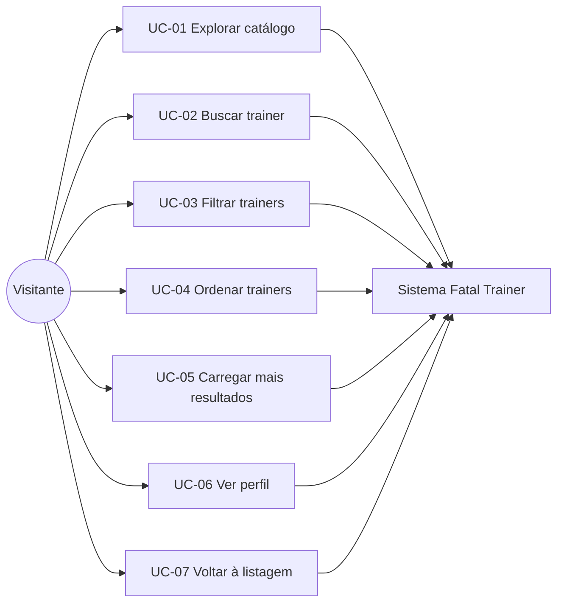

# Casos de Uso — Fatal Trainer

**Produto:** Catálogo de personal trainers autônomos  
**Documento base:** [PRD.md](./PRD.md) · [requisitos-funcionais.md](./requisitos-funcionais.md)  
**Versão:** 1.0  
**Segmento:** Personal trainers

---

## 1. Introdução

Este documento descreve os **casos de uso (UC)** da aplicação Fatal Trainer no formato:

- **Atores** envolvidos
- **Pré-condições** e **pós-condições**
- **Fluxo principal**
- **Fluxos alternativos** e **de exceção**
- **Requisitos funcionais** relacionados

### 1.1 Diagrama de contexto

### 1.2 Atores

| Ator | Descrição |
|------|-----------|
| **Visitante** | Usuário final que busca personal trainer; não autenticado |
| **Sistema** | Aplicação web (Nuxt) responsável por renderizar UI, filtrar dados e gerenciar navegação |

### 1.3 Mapa UC → RF

| UC | Nome | RF relacionados |
|----|------|-----------------|
| UC-01 | Explorar catálogo de personal trainers | RF-001, RF-002, RF-006, RF-010, RF-011 |
| UC-02 | Buscar personal trainer | RF-003, RF-012 |
| UC-03 | Filtrar personal trainers | RF-004, RF-012 |
| UC-04 | Ordenar personal trainers | RF-005 |
| UC-05 | Carregar mais resultados | RF-006, RF-012 |
| UC-06 | Visualizar perfil do personal trainer | RF-007, RF-008, RF-013 |
| UC-07 | Retornar à listagem | RF-009 |

---

## UC-01 — Explorar catálogo de personal trainers

| Campo | Descrição |
|-------|-----------|
| **ID** | UC-01 |
| **Atores** | Visitante (primário), Sistema |
| **Objetivo** | Visualizar personal trainers disponíveis para comparar opções |
| **RF** | RF-001, RF-002, RF-006, RF-010, RF-011 |

### Pré-condições

- Dataset com ≥ 500 personal trainers carregado ou acessível via API mock
- Visitante acessa a URL raiz da aplicação

### Pós-condições (sucesso)

- Primeiro lote de cards exibido na tela
- Visitante pode interagir com busca, filtros, ordenação ou abrir perfil

### Fluxo principal

1. Visitante abre a aplicação (`/`).
2. Sistema exibe estado de loading (skeleton) enquanto busca o primeiro lote.
3. Sistema consulta personal trainers (página 1, tamanho padrão, ordenação default).
4. Sistema renderiza cards com foto, nome, especialidade, preço da sessão e dados secundários (avaliação/distância, se disponíveis).
5. Sistema exibe contador de resultados (ex.: "500 personal trainers" ou "24 de 500").
6. Visitante visualiza a listagem em layout responsivo.

### Fluxos alternativos

**1a — Primeira visita em mobile**

- No passo 4, layout em coluna única; filtros acessíveis via botão "Filtros".

**1b — Primeira visita em desktop**

- No passo 4, grid com múltiplas colunas; painel de filtros lateral ou no topo.

### Fluxos de exceção

**E1 — Falha ao carregar dados**

1. Sistema não obtém dados do JSON/API.
2. Sistema exibe mensagem de erro e botão "Tentar novamente".
3. Caso de uso encerra sem listagem.

---

## UC-02 — Buscar personal trainer

| Campo | Descrição |
|-------|-----------|
| **ID** | UC-02 |
| **Atores** | Visitante (primário), Sistema |
| **Objetivo** | Encontrar trainers por nome ou especialidade |
| **RF** | RF-003, RF-012 |
| **Extends** | UC-01 (visitante já está na listagem) |

### Pré-condições

- Listagem inicial carregada (UC-01 concluído ou em andamento)

### Pós-condições (sucesso)

- Listagem exibe apenas trainers que correspondem ao termo de busca (combinado com filtros ativos)

### Fluxo principal

1. Visitante digita termo no campo de busca (ex.: "Marcos", "funcional", "emagrecimento").
2. Sistema aguarda debounce (150–300 ms).
3. Sistema executa busca case-insensitive em `name` e `profession`/`specialties`.
4. Sistema reinicia paginação para página 1.
5. Sistema renderiza cards filtrados.
6. Sistema atualiza contador de resultados.

### Fluxos alternativos

**2a — Limpar busca**

1. Visitante apaga o texto do campo de busca.
2. Sistema restaura listagem conforme filtros e ordenação ativos (sem termo de busca).

**2b — Busca combinada com filtros**

1. Visitante já aplicou filtros (UC-03).
2. Busca restringe apenas o subconjunto já filtrado.

### Fluxos de exceção

**E1 — Nenhum resultado**

1. Termo não corresponde a nenhum trainer.
2. Sistema exibe empty state: "Nenhum personal trainer encontrado para «termo»".
3. Sistema sugere limpar busca ou ajustar filtros.

---

## UC-03 — Filtrar personal trainers

| Campo | Descrição |
|-------|-----------|
| **ID** | UC-03 |
| **Atores** | Visitante (primário), Sistema |
| **Objetivo** | Restringir listagem por critérios relevantes (preço, especialidade, modalidade, etc.) |
| **RF** | RF-004, RF-012 |
| **Extends** | UC-01 |

### Pré-condições

- Visitante na página de listagem

### Pós-condições (sucesso)

- Listagem reflete apenas trainers que atendem aos filtros selecionados

### Fluxo principal

1. Visitante abre painel de filtros (bottom sheet no mobile, sidebar no desktop).
2. Visitante seleciona critérios (ex.: especialidade "CrossFit", preço R$ 100–180, modalidade "Presencial").
3. Visitante confirma aplicação dos filtros ("Aplicar" ou aplicação automática).
4. Sistema valida combinação de filtros.
5. Sistema reinicia paginação para página 1.
6. Sistema renderiza cards filtrados e exibe chips/indicadores de filtros ativos.
7. Sistema atualiza contador (ex.: "18 personal trainers").

### Fluxos alternativos

**3a — Limpar todos os filtros**

1. Visitante clica em "Limpar filtros".
2. Sistema remove filtros e recarrega listagem (mantendo busca, se houver).

**3a — Filtro único**

1. Visitante aplica apenas faixa de preço.
2. Fluxo continua no passo 4 com um critério.

### Fluxos de exceção

**E1 — Combinação sem resultados**

1. Filtros aplicados não retornam trainers.
2. Sistema exibe empty state com opção de limpar filtros.

---

## UC-04 — Ordenar personal trainers

| Campo | Descrição |
|-------|-----------|
| **ID** | UC-04 |
| **Atores** | Visitante (primário), Sistema |
| **Objetivo** | Reordenar resultados para facilitar comparação (preço, avaliação, distância) |
| **RF** | RF-005 |
| **Extends** | UC-01, UC-02, UC-03 |

### Pré-condições

- Listagem visível (possivelmente já filtrada/buscada)

### Pós-condições (sucesso)

- Cards exibidos na ordem selecionada

### Fluxo principal

1. Visitante abre seletor de ordenação.
2. Visitante escolhe critério (ex.: "Menor preço", "Melhor avaliação", "Mais próximo").
3. Sistema aplica ordenação sobre conjunto atual (pós-busca/filtro).
4. Sistema reinicia paginação para página 1.
5. Sistema re-renderiza cards na nova ordem.

### Fluxos alternativos

**4a — Inverter ordem de preço**

1. Visitante alterna entre "Menor preço" e "Maior preço".

### Fluxos de exceção

**E1 — Critério indisponível para alguns registros**

1. Ordenação por distância, mas alguns trainers não têm `distanceKm`.
2. Sistema coloca registros sem distância ao final (regra documentada no README).

---

## UC-05 — Carregar mais resultados (scroll infinito / paginação)

| Campo | Descrição |
|-------|-----------|
| **ID** | UC-05 |
| **Atores** | Visitante (primário), Sistema |
| **Objetivo** | Ver mais personal trainers além do primeiro lote, sem degradar performance |
| **RF** | RF-006, RF-011, RF-012 |
| **Extends** | UC-01 |

### Pré-condições

- Primeiro lote carregado
- Existem mais resultados (`hasMore === true`)

### Pós-condições (sucesso)

- Novos cards appendados à listagem sem duplicatas

### Fluxo principal

1. Visitante rola até o final da listagem **ou** clica "Carregar mais" **ou** navega para página seguinte.
2. Sistema detecta trigger (Intersection Observer, clique ou paginação).
3. Sistema exibe indicador de loading no rodapé.
4. Sistema solicita próxima página (`page + 1`) mantendo busca, filtros e ordenação.
5. Sistema appenda novos cards ao final da lista.
6. Sistema oculta loading.
7. Visitante continua explorando.

### Fluxos alternativos

**5a — Última página**

1. Não há mais resultados.
2. Sistema exibe mensagem sutil ("Você viu todos os personal trainers") ou remove sentinel.
3. Caso de uso encerra.

**5b — Busca/filtro alterado durante scroll**

1. Visitante altera busca ou filtro com itens já carregados.
2. Sistema descarta lista atual, reinicia da página 1 (UC-02 ou UC-03).

### Fluxos de exceção

**E1 — Falha ao carregar próxima página**

1. Requisição falha.
2. Sistema exibe erro e botão "Tentar novamente" no rodapé.
3. Visitante pode retentar sem perder itens já carregados.

---

## UC-06 — Visualizar perfil do personal trainer

| Campo | Descrição |
|-------|-----------|
| **ID** | UC-06 |
| **Atores** | Visitante (primário), Sistema |
| **Objetivo** | Conhecer detalhes do personal trainer antes de contato/contratação |
| **RF** | RF-007, RF-008, RF-013 |

### Pré-condições

- Personal trainer existe no dataset com `id` válido

### Pós-condições (sucesso)

- Perfil completo exibido; URL compartilhável

### Fluxo principal

1. Visitante clica/toca em um card na listagem **ou** acessa URL direta `/personal-trainers/{id}`.
2. Sistema navega para página de perfil.
3. Sistema busca registro completo pelo `id`.
4. Sistema renderiza:
   - Foto, nome, especialidade
   - Descrição / bio
   - Valor da sessão (BRL)
   - Avaliação média e distância (se disponíveis)
   - Bloco complementar (especialidades, modalidades, CREF, galeria, disponibilidade ou avaliações)
5. Sistema define meta tags SEO (title, description).
6. Visitante lê informações e decide próximo passo (voltar, compartilhar URL — futuro).

### Fluxos alternativos

**6a — Acesso via deep link**

1. Visitante abre link compartilhado diretamente no perfil.
2. Sistema carrega perfil sem passar pela listagem.
3. Botão "Voltar ao catálogo" leva à listagem (UC-07).

**6b — Perfil com dados parciais**

1. Trainer não possui galeria ou CREF.
2. Sistema omite seções ausentes sem quebrar layout.

### Fluxos de exceção

**E1 — ID inexistente**

1. Sistema não encontra trainer.
2. Sistema exibe página 404 com link para catálogo.

**E2 — Falha ao carregar perfil**

1. Erro de rede ou parse.
2. Sistema exibe mensagem de erro e opção de retry.

---

## UC-07 — Retornar à listagem

| Campo | Descrição |
|-------|-----------|
| **ID** | UC-07 |
| **Atores** | Visitante (primário), Sistema |
| **Objetivo** | Voltar ao catálogo mantendo contexto de busca/filtros quando possível |
| **RF** | RF-009 |

### Pré-condições

- Visitante está na página de perfil (UC-06)

### Pós-condições (sucesso)

- Listagem visível; filtros/busca/ordenação preservados (Should)

### Fluxo principal

1. Visitante clica "Voltar" ou usa botão back do browser.
2. Sistema navega para `/` (ou histórico anterior).
3. **Should:** Sistema restaura query params (`?search=&specialty=&sortBy=`) da URL.
4. Sistema re-renderiza listagem no estado anterior.
5. **Should:** Sistema restaura posição de scroll.

### Fluxos alternativos

**7a — Voltar via logo/header**

1. Visitante clica no logo "Fatal Trainer".
2. Sistema navega à listagem (pode resetar filtros — comportamento documentado).

**7b — Deep link sem histórico**

1. Visitante entrou direto no perfil.
2. "Voltar ao catálogo" leva à listagem padrão (sem estado prévio).

---

## 2. Cenários integrados (jornadas)

### Jornada A — Marina encontra personal funcional perto dela (mobile)

| Passo | UC | Ação |
|-------|-----|------|
| 1 | UC-01 | Abre app no celular, vê listagem |
| 2 | UC-03 | Filtra: especialidade Funcional, modalidade Presencial |
| 4 | UC-04 | Ordena por distância |
| 5 | UC-05 | Rola e carrega mais cards |
| 6 | UC-06 | Abre perfil de "Rafael Costa" |
| 7 | UC-07 | Volta e compara outro trainer |

### Jornada B — Carlos compara preços no desktop

| Passo | UC | Ação |
|-------|-----|------|
| 1 | UC-01 | Abre catálogo no desktop |
| 2 | UC-02 | Busca "musculação" |
| 3 | UC-04 | Ordena por menor preço |
| 4 | UC-06 | Abre 2–3 perfis em sequência (histórico) |
| 5 | UC-07 | Retorna via back preservando filtros |

### Jornada C — Link compartilhado

| Passo | UC | Ação |
|-------|-----|------|
| 1 | UC-06 | Acessa `/personal-trainers/abc123` direto |
| 2 | UC-07 | Clica "Ver todos os personal trainers" |

---

## 3. Especificação por persona

### Marina (28) — mobile, pouco tempo

| Necessidade | Casos de uso principais |
|-------------|-------------------------|
| Achar trainer rápido | UC-02, UC-03, UC-04 |
| Ver preço e avaliação no card | UC-01 |
| Detalhes antes de contato | UC-06 |

### Carlos (45) — desktop, compara opções

| Necessidade | Casos de uso principais |
|-------------|-------------------------|
| Comparar vários perfis | UC-04, UC-06, UC-07 |
| Filtrar por faixa de preço | UC-03 |
| Explorar catálogo completo | UC-01, UC-05 |

---

## 4. Histórico

| Versão | Data | Alterações |
|--------|------|------------|
| 1.0 | 2026-06-04 | Versão inicial — segmento personal trainer |
