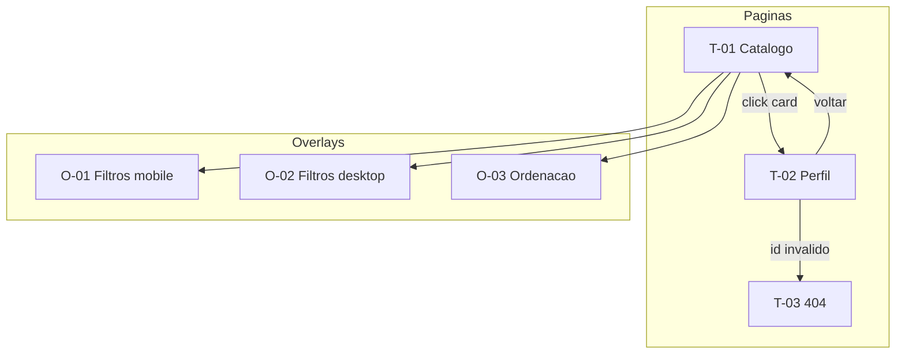
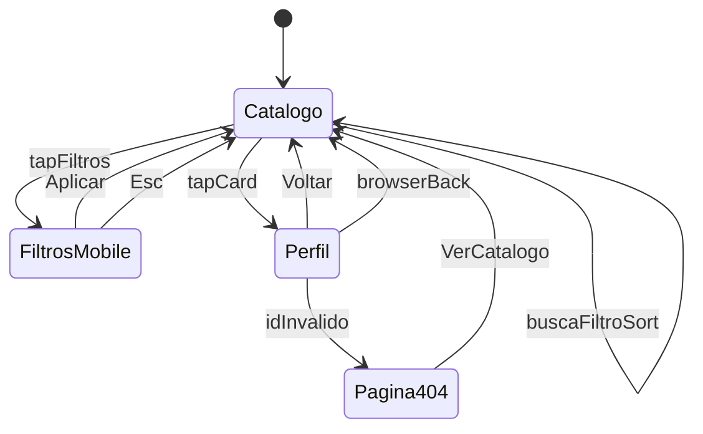

# PRD de Design — Fatal Trainer

**Produto:** Catálogo e descoberta de personal trainers autônomos  
**Documento base:** [PRD.md](./PRD.md) · [requisitos-funcionais.md](./requisitos-funcionais.md) · [casos-de-uso.md](./casos-de-uso.md) · [requisitos-nao-funcionais.md](./requisitos-nao-funcionais.md)  
**Stack de UI:** Nuxt UI + Tailwind CSS (mobile first)  
**Mockup Pencil:** [design/fatal-trainer.pen](../design/fatal-trainer.pen)  
**Especificação de componentes (código):** [arquitetura/especificacao-componentes-ft.md](./arquitetura/especificacao-componentes-ft.md)  
**Versão:** 1.2  
**Status:** Especificação aprovada — UI flat, backgrounds apenas em botões  

---

## Índice

1. [Introdução](#1-introdução)
2. [Inventário de telas](#2-inventário-de-telas)
3. [Identidade visual](#3-identidade-visual)
4. [Componentes de domínio](#4-componentes-de-domínio)
5. [Especificação por tela](#5-especificação-por-tela)
6. [Estados de UI (S-01)](#6-estados-de-ui-s-01)
7. [Padrões de interação](#7-padrões-de-interação)
8. [Acessibilidade e SEO (design)](#8-acessibilidade-e-seo-design)
9. [Fluxo de navegação](#9-fluxo-de-navegação)
10. [Apêndices](#10-apêndices)

---

## 1. Introdução

### 1.1 Propósito

Este documento especifica **como** a interface do Fatal Trainer deve ser construída visualmente e comportamentalmente. Complementa o [PRD](./PRD.md) (visão de produto) e os [requisitos funcionais](./requisitos-funcionais.md) (regras de negócio), focando em:

- Identidade visual da marca Fatal Trainer
- Layout e hierarquia por tela e breakpoint
- Anatomia de componentes de domínio
- Estados visuais (loading, empty, error)
- Padrões de interação mobile e desktop

**Não duplica** regras de negócio já descritas nos RFs; referencia-os por ID.

### 1.2 Princípios de design

| Princípio | Aplicação |
|-----------|-----------|
| Mobile first | Layout base em coluna única; complexidade cresce em `sm`/`md`/`lg` |
| Clareza | Hierarquia: nome > especialidade > preço > avaliação > modalidade |
| Performance percebida | Skeletons com dimensões fixas; sem layout shift em imagens |
| Confiança | Visual profissional fitness; CREF, avaliações e preço transparentes |
| Acessibilidade | Contraste AA, teclado, leitores de tela (RNF-004) |

### 1.3 Matriz de rastreabilidade

| ID | Tela / Componente | RF | UC | Prioridade |
|----|-------------------|----|----|------------|
| T-01 | Catálogo (listagem) | RF-001–006, RF-012 | UC-01–05 | Must |
| T-02 | Perfil do trainer | RF-007–009, RF-013 | UC-06–07 | Must |
| T-03 | Página 404 | RN-008 | UC-06 E1 | Must |
| O-01 | Filtros mobile | RF-004, RF-012 | UC-03 | Must |
| O-02 | Filtros desktop | RF-004, RF-012 | UC-03 | Must |
| O-03 | Ordenação | RF-005 | UC-04 | Must |
| S-01 | Estados transversais | RF-012 | UC-02, UC-03, UC-05 | Should |
| — | AppHeader | RF-009 | UC-07 | Must |
| — | SearchBar | RF-003 | UC-02 | Must |
| — | TrainerCard | RF-002 | UC-01 | Must |
| — | TrainerList | RF-001, RF-006 | UC-01, UC-05 | Must |
| — | ProfileHero | RF-007 | UC-06 | Must |
| — | ProfileSection | RF-008 | UC-06 | Should |

---

## 2. Inventário de telas

| ID | Tela | Rota | Descrição |
|----|------|------|-----------|
| T-01 | Catálogo | `/` | Listagem com busca, filtros, ordenação e scroll infinito |
| T-02 | Perfil | `/personal-trainers/[id]` | Detalhe completo do personal trainer |
| T-03 | 404 | fallback Nuxt | Trainer inexistente ou rota inválida |
| O-01 | Filtros mobile | overlay em T-01 | `UDrawer` acionado pelo FAB "Filtros" |
| O-02 | Filtros desktop | coluna em T-01 | Sidebar fixa à esquerda (≥ `lg`) |
| O-03 | Ordenação | dropdown em T-01 | Seletor de critério de ordenação |
| S-01 | Estados | embutidos | Loading, empty, error, fim de lista |



---

## 3. Identidade visual

### 3.1 Tom e personalidade

Marketplace fitness **editorial e minimal**: fundo branco plano, hierarquia tipográfica forte, roxo como acento em preço e CTAs. Apenas botões (ícones, FAB Filtros, Contratar) possuem background colorido; conteúdo usa separadores e espaço em branco.

### 3.2 Paleta de cores

Tokens customizados estendendo Nuxt UI via `app.config.ts` / `app/assets/css/theme.css`:

| Token | Valor | Tailwind ref. | Uso |
|-------|-------|---------------|-----|
| `primary` | `#7C3AED` | violet-600 | CTAs, logo "Fatal", filtros ativos, preço |
| `primary-hover` | `#6D28D9` | violet-700 | hover em botões primary |
| `primary-subtle` | `#EDE9FE` | violet-100 | fundo de chips selecionados |
| `bubble-lavender` | `#DDD6FE` | violet-200 | gradient bubble decorativo |
| `bubble-sky` | `#BAE6FD` | sky-200 | gradient bubble decorativo |
| `bubble-pink` | `#FBCFE8` | pink-200 | gradient bubble decorativo |
| `bubble-violet` | `#C4B5FD` | violet-300 | gradient bubble decorativo |
| `glass-surface` | `rgba(255,255,255,0.85)` | white/85 | cards glass |
| `accent` | `#EA580C` | orange-600 | rating highlight, badges secundários |
| `accent-subtle` | `#FFEDD5` | orange-100 | fundo badge modalidade |
| `neutral-900` | `#0F172A` | slate-900 | texto principal |
| `neutral-600` | `#475569` | slate-600 | texto secundário, captions |
| `neutral-200` | `#E2E8F0` | slate-200 | bordas glass sutis |
| `surface` | `#FFFFFF` | white | cards sólidos |
| `surface-muted` | `#FAFAFF` | custom | fundo base da página |
| `error` | `#DC2626` | red-600 | mensagens de erro |
| `rating` | `#EAB308` | yellow-500 | ícones de estrela |

**Contraste:** textos principais sobre `glass-surface` (≥85% opacidade) devem atingir WCAG 2.1 AA (≥ 4,5:1).

### 3.3 Tipografia

Fonte **Plus Jakarta Sans** (Google Fonts). Corpo mínimo **16px** no mobile (RNF-003).

| Estilo | Tamanho mobile | Tamanho desktop | Peso | Uso |
|--------|----------------|-----------------|------|-----|
| Display / `h1` | 24px / 1.5rem | 32px / 2rem | 700 | Nome do trainer no perfil |
| Heading / `h2` | 20px / 1.25rem | 24px / 1.5rem | 600 | Seções do perfil, contador |
| Title / `h3` | 18px / 1.125rem | 18px | 600 | Nome no card |
| Body | 16px / 1rem | 16px | 400 | Bio, descrições |
| Body sm | 14px / 0.875rem | 14px | 400 | Profissão no card |
| Caption | 12px / 0.75rem | 12px | 400 | Distância, review count |
| Price | 18px / 1.125rem | 20px | 700 | Valor da sessão (cor `primary`) |

### 3.4 Espaçamento e grid

| Token | Valor | Uso |
|-------|-------|-----|
| `space-1` | 4px | gap interno mínimo |
| `space-2` | 8px | padding chips, gap avatar-texto |
| `space-3` | 12px | padding interno de card |
| `space-4` | 16px | padding de seção mobile |
| `space-6` | 24px | gap entre cards, padding desktop |
| `space-8` | 32px | margem entre seções do perfil |

**Grid de listagem:**

| Breakpoint | Layout | Gap |
|------------|--------|-----|
| default (< 1024px) | Lista vertical flat (1 coluna) | separador `border-b` |
| `lg` (≥ 1024px) | Sidebar filtros + lista vertical | 24px |

**Touch targets:** botões, chips e áreas clicáveis ≥ **44×44 px** no mobile (RNF-003).

### 3.5 Elevação e bordas

| Elemento | Estilo |
|----------|--------|
| Fundo da página | `#FFFFFF` plano, sem bubbles |
| Item de lista | Sem background; `border-b border-slate-100 py-5` |
| Header | `bg-white border-b border-slate-100 sticky top-0` |
| Botão ícone | `.btn-icon-surface` — branco, borda slate, sombra leve |
| FAB Filtros | `.btn-fab` — pill roxo fixo bottom-center (mobile) |
| CTA perfil | `.btn-cta-pill` — pill roxo full-width sticky bottom |
| Campo busca | `.search-pill` — `bg-slate-100` (form control) |
| Sheet perfil | `.sheet-top` — branco sólido `rounded-t-3xl` sobre hero |

### 3.8 Regra: backgrounds apenas em botões

Conteúdo (cards de listagem, seções do perfil, badges) **não** usa fundo colorido ou glass. Hierarquia via tipografia, cor do texto e separadores. Exceção: input de busca com fill neutro (`slate-100`).

**Perfil mobile:** hero full-bleed; sheet branco `-mt-10 rounded-t-3xl`; botões flutuantes brancos (voltar, chat, favorito); CTA sticky "Contratar personal".

**Listagem mobile:** rows horizontais flat; rating top-right; FAB "Filtros" abre `UDrawer`.

### 3.6 Ícones

Usar ícones do ecossistema Nuxt UI (Heroicons). Tamanho padrão: 20px em controles, 16px inline com texto.

| Contexto | Ícone sugerido |
|----------|----------------|
| Busca | `i-heroicons-magnifying-glass` |
| Filtros | `i-heroicons-adjustments-horizontal` |
| Ordenar | `i-heroicons-arrows-up-down` |
| Voltar | `i-heroicons-arrow-left` |
| Estrela | `i-heroicons-star-solid` |
| Localização | `i-heroicons-map-pin` |
| Fechar chip | `i-heroicons-x-mark` |

### 3.7 Configuração Nuxt UI (referência)

```typescript
// app.config.ts — referência para implementação
export default defineAppConfig({
  ui: {
    colors: {
      primary: 'violet',
      neutral: 'slate',
    },
  },
})
```

---

## 4. Componentes de domínio

### 4.1 AppHeader

**Base Nuxt UI:** composição com `UButton` (ghost)  
**RF:** RF-009 · **UC:** UC-07

| Parte | Especificação |
|-------|---------------|
| Logo | Texto "Fatal Trainer" — "Fatal" em `primary`, "Trainer" em `neutral-900`, peso 700 |
| Altura | 56px mobile, 64px desktop |
| Posição | Sticky top, `z-50`, fundo `surface` com borda inferior |
| Comportamento logo | Clique navega para `/` **sem** resetar filtros se houver query params na URL de origem; na listagem, clique reseta para estado padrão (documentar no README) |

**Estados:** default apenas (sem variantes).

---

### 4.2 SearchBar

**Base Nuxt UI:** `UInput` com slot leading icon  
**RF:** RF-003 · **UC:** UC-02

| Propriedade | Valor |
|-------------|-------|
| Placeholder | "Buscar por nome ou especialidade" |
| Ícone | Lupa à esquerda |
| Debounce | 200 ms |
| Largura | 100% mobile; flex-grow em desktop |
| `aria-label` | "Buscar personal trainers" |

**Estados:**

| Estado | Visual |
|--------|--------|
| Default | borda `neutral-200`, fundo branco |
| Focus | ring `primary`, borda `primary` |
| Com valor | botão clear (×) à direita, 44px touch target |

---

### 4.3 FilterPanel

**Base Nuxt UI:** `USlideover` (mobile) · `UCard` em sidebar (desktop)  
**RF:** RF-004 · **UC:** UC-03

**Dimensões de filtro (Must — implementar ≥ 1; recomendado implementar todos):**

| Filtro | Controle | Visual |
|--------|----------|--------|
| Faixa de preço | Dois `UInput` number ou range | Label "Preço por sessão (R$)" |
| Especialidade | `UCheckbox` group ou chips multi-select | Opções: Musculação, Funcional, CrossFit, HIIT, Emagrecimento, Pilates |
| Avaliação mínima | `USelect` | Opções: Qualquer, ≥ 3,0, ≥ 4,0, ≥ 4,5 |
| Modalidade | `UCheckbox` group | Presencial, Online, Híbrido |
| Cidade | `USelect` ou `UInput` | Should — lista das cidades do dataset |

**Footer mobile (O-01):** botão "Limpar" (ghost, esquerda) + "Aplicar filtros" (primary, direita), largura igual, min-height 44px.

**Desktop (O-02):** sidebar 280px, sticky abaixo do header; filtros aplicam **automaticamente** ao alterar valor (sem botão Aplicar); link "Limpar filtros" no rodapé da sidebar.

---

### 4.4 SortSelect

**Base Nuxt UI:** `USelect` ou `UDropdownMenu`  
**RF:** RF-005 · **UC:** UC-04

| Opção | Valor interno |
|-------|---------------|
| Relevância (padrão) | `default` |
| Menor preço | `price-asc` |
| Maior preço | `price-desc` |
| Melhor avaliação | `rating-desc` |
| Mais próximo | `distance-asc` |
| Nome A–Z | `name-asc` |

Label visível: "Ordenar" + valor selecionado truncado se necessário.

---

### 4.5 ActiveFilterChips

**Base Nuxt UI:** `UBadge` com botão dismiss  
**RF:** RF-004

Exibidos abaixo da barra de busca/ações quando ≥ 1 filtro ativo.

| Propriedade | Valor |
|-------------|-------|
| Cor | `primary-subtle` fundo, texto `primary` |
| Dismiss | ícone × com `aria-label="Remover filtro {nome}"` |
| Scroll horizontal | sim, no mobile, se chips excederem largura |

Exemplo: `Funcional` · `Presencial` · `R$ 80–200`

---

### 4.6 TrainerCard

**Base Nuxt UI:** `UCard`, `UAvatar`, `UBadge`  
**RF:** RF-002 · **UC:** UC-01

**Anatomia:**

```
┌──────────────────────────────────────┐
│ ┌────────┐  Nome do trainer    (h3) │
│ │ Avatar │  Profissão / esp.  (sm)  │
│ │ 64×64  │  R$ XXX,XX/sessão  (bold)│
│ └────────┘  ★ 4,8 (127) · 2,3 km     │
│             [Presencial] [Online]    │
└──────────────────────────────────────┘
```

| Campo | Prioridade | Especificação visual |
|-------|------------|---------------------|
| Foto | Must | `UAvatar` 64×64 mobile, 72×72 desktop; `aspect-ratio: 1`; fallback iniciais |
| Nome | Must | `h3`, truncar 1 linha com ellipsis |
| Profissão | Must | `body sm`, `neutral-600`, 2 linhas max |
| Preço | Must | "R$ {valor}/sessão", formatação BRL, peso 700 |
| Avaliação | Should | estrela `rating` + nota + count entre parênteses |
| Distância | Should | caption com ícone map-pin |
| Modalidade | Should | `UBadge` size xs, cor `accent-subtle` |

**Estados:**

| Estado | Comportamento |
|--------|---------------|
| Default | card clicável inteiro (`<NuxtLink>` ou `@click`) |
| Hover (desktop) | `shadow-md`, cursor pointer |
| Focus (teclado) | ring 2px `primary`, offset 2px |
| Active | leve scale ou darken — opcional |

**A11y:** `role="article"` ou link semântico; `aria-label="Ver perfil de {nome}"`; foto com `alt="Foto de {nome}, personal trainer"`.

**Dimensões fixas:** reservar altura mínima ~120px para evitar CLS (RNF-002).

---

### 4.7 TrainerCardSkeleton

**Base Nuxt UI:** `USkeleton`  
**RF:** RF-012

Espelha exatamente o layout do `TrainerCard`: retângulo avatar + 3 linhas de texto + badge row. Mesma altura e gap do card real.

---

### 4.8 TrainerList

**Base:** grid Tailwind responsivo  
**RF:** RF-001, RF-006

| Propriedade | Valor |
|-------------|-------|
| Container | `max-w-7xl mx-auto px-4 lg:px-6` |
| Grid | conforme §3.4 |
| Sentinel | div invisível 1px no final; Intersection Observer |
| pageSize | 12–24 cards por lote |

---

### 4.9 ResultsCounter

**RF:** RF-004

Texto `body sm`, cor `neutral-600`.

| Contexto | Copy |
|----------|------|
| Sem filtros | "{total} personal trainers" |
| Com filtros/busca | "{filtered} personal trainers" ou "{filtered} de {total}" |
| Carregando | omitir ou "Carregando..." |

---

### 4.10 LoadMoreSentinel

**RF:** RF-006 · **UC:** UC-05

Rodapé da lista: spinner centralizado + "Carregando..." enquanto `hasMore && loading`. Altura fixa 48px para evitar layout shift.

---

### 4.11 EmptyState

**Base:** composição com ícone Heroicons + tipografia + `UButton`  
**RF:** RF-012

| Variante | Ícone | Título | CTA |
|----------|-------|--------|-----|
| Busca vazia | `magnifying-glass` | "Nenhum personal trainer encontrado para «{termo}»" | "Limpar busca" |
| Filtros vazios | `adjustments-horizontal` | "Nenhum resultado com esses filtros" | "Limpar filtros" |
| Ambos | idem busca | combinar mensagens | "Limpar tudo" |

Centralizado verticalmente na área da lista; padding 48px.

---

### 4.12 ErrorState

**Base:** `UButton` retry + mensagem  
**RF:** RF-012

| Variante | Copy | Ação |
|----------|------|------|
| Listagem | "Não foi possível carregar os personal trainers." | "Tentar novamente" |
| Paginação (inline) | "Erro ao carregar mais." | "Tentar novamente" (link/button inline) |
| Perfil | "Não foi possível carregar este perfil." | "Tentar novamente" + link catálogo |

Cor do título: `error`; botão primary.

---

### 4.13 ProfileHero

**RF:** RF-007 · **UC:** UC-06

```
Mobile                          Desktop
┌─────────────────────┐         ┌─────────────────────────────────┐
│ [← Voltar]          │         │ [← Voltar ao catálogo]          │
├─────────────────────┤         ├──────────────┬──────────────────┤
│                     │         │              │ Nome (h1)        │
│   Foto 4:3 full     │         │  Foto 1:1    │ Profissão        │
│   width             │         │  320×320     │ R$ XXX/sessão    │
│                     │         │              │ ★ 4,8 · SP · 2km │
├─────────────────────┤         │              │ [Presencial]     │
│ Nome (h1)           │         └──────────────┴──────────────────┤
│ Profissão           │         │ Bio...                          │
│ R$ XXX/sessão       │         └─────────────────────────────────┘
│ ★ 4,8 · SP · 2,3 km │
│ [Presencial][Online]│
└─────────────────────┘
```

| Elemento | Especificação |
|----------|---------------|
| Foto | Mobile: full-width, max-height 280px, `object-fit: cover`, aspect-ratio 4:3. Desktop: coluna esquerda 320px, 1:1 |
| Nome | `h1`, único da página |
| Preço | destaque `accent` ou bold grande |
| Meta row | rating + cidade + distância separados por · |
| Badges modalidade | `UBadge` accent-subtle |

---

### 4.14 ProfileSection

**RF:** RF-008 · **UC:** UC-06

Bloco empilhado com título `h2` + conteúdo. Omitir seção inteira se dados ausentes.

| Seção | Conteúdo | Visual |
|-------|----------|--------|
| Sobre | `description` | parágrafo body, line-height 1.6 |
| Especialidades | `specialties[]` | chips ou lista com bullets |
| Modalidades | `modalities[]` | badges + texto descritivo |
| Certificação | `cref` | ícone shield + texto monospace |
| Disponibilidade | `availability` | ícone relógio + texto |
| Experiência | `experienceYears` | "{n} anos de experiência" |
| Galeria | `gallery[]` | grid 2 col mobile, 3 col desktop; lazy load |
| Avaliações | `reviews[]` | cards empilhados: autor, estrelas, comentário |

Padding entre seções: 24px. Divisor opcional `border-b neutral-200`.

---

### 4.15 BackLink

**Base Nuxt UI:** `UButton` variant ghost, size sm  
**RF:** RF-009

| Propriedade | Valor |
|-------------|-------|
| Label | "Voltar ao catálogo" |
| Ícone | arrow-left leading |
| Posição | topo do conteúdo, abaixo do header |
| Comportamento | `router.back()` se histórico; fallback navega `/` com query params preservados |

---

## 5. Especificação por tela

### 5.1 T-01 — Catálogo (listagem)

**Rota:** `/`  
**RF:** RF-001–006, RF-012 · **UC:** UC-01–05

#### Wireframe — Mobile (< 640px)

```
┌─────────────────────────────┐
│ ○ ○ gradient bubbles (bg)   │
│ Fatal Trainer (glass hdr)   │
├─────────────────────────────┤
│ (🔍 Buscar...        ) pill │  ← SearchBar glass
│ [Filtros ▾]  [Ordenar ▾]    │
│ 42 personal trainers        │
├─────────────────────────────┤
│ ╭─────────────────────────╮ │
│ │ [img] Ana Silva  R$120  │ │  ← glass card horizontal
│ │       Funcional  ★4.8   │ │
│ ╰─────────────────────────╯ │
│ ╭─────────────────────────╮ │
│ │ [img] Marcos    R$ 95   │ │
│ ╰─────────────────────────╯ │
│        ◌ Carregando...      │
└─────────────────────────────┘
```

#### Wireframe — Desktop (≥ 1024px)

```
┌──────────┬──────────────────────────────────────────────┐
│ Fatal Trainer (header full width, sticky)                │
├──────────┼──────────────────────────────────────────────┤
│ FILTROS  │ [🔍 Buscar por nome ou especialidade...] [Ord▾]│
│          │ Funcional ×  Presencial ×                     │
│ Preço    │ 42 personal trainers                          │
│ [__–__]  ├──────────────────────────────────────────────┤
│          │ ┌────────┐ ┌────────┐ ┌────────┐ ┌────────┐  │
│ Especial.│ │ Card 1 │ │ Card 2 │ │ Card 3 │ │ Card 4 │  │
│ □ Musc.  │ └────────┘ └────────┘ └────────┘ └────────┘  │
│ □ Func.  │ ┌────────┐ ┌────────┐ ┌────────┐ ┌────────┐  │
│ □ Cross. │ │ Card 5 │ │ Card 6 │ │ Card 7 │ │ Card 8 │  │
│          │ └────────┘ └────────┘ └────────┘ └────────┘  │
│ Modalid. │              ... scroll infinito              │
│ □ Pres.  │              ◌ Carregando...                  │
│ □ Online │                                               │
│          │                                               │
│ [Limpar] │                                               │
└──────────┴──────────────────────────────────────────────┘
     O-02 sidebar 280px              TrainerList 3-4 cols
```

#### Tabela de especificação — T-01

| Elemento | Mobile (<640) | Tablet (md) | Desktop (lg) | Comportamento | RF |
|----------|---------------|-------------|--------------|---------------|-----|
| AppHeader | sticky, full width | idem | idem | logo → `/` | RF-009 |
| SearchBar | full width, abaixo header | idem | coluna principal, max 480px | debounce 200ms | RF-003 |
| Botão Filtros | visível, abre O-01 | visível | oculto (sidebar O-02) | badge count se filtros ativos | RF-004 |
| SortSelect | dropdown compacto | idem | alinhado à direita da busca | reinicia paginação | RF-005 |
| ActiveFilterChips | scroll horizontal | wrap | wrap | dismiss remove filtro | RF-004 |
| ResultsCounter | abaixo chips | idem | abaixo busca | atualiza em tempo real | RF-004 |
| FilterPanel | O-01 slideover | O-01 ou sidebar colapsável | O-02 sidebar 280px sticky | limpar/aplicar | RF-004 |
| TrainerList grid | 1 col | 2 col | 3–4 col | infinite scroll | RF-001, RF-006 |
| TrainerCardSkeleton | 6 cards | 8 cards | 12 cards | loading inicial | RF-012 |
| EmptyState | centralizado | idem | idem | substitui grid | RF-012 |
| LoadMoreSentinel | footer lista | idem | idem | Intersection Observer | RF-006 |

---

### 5.2 O-01 — Painel de filtros (mobile)

**RF:** RF-004 · **UC:** UC-03

#### Wireframe

```
┌─────────────────────────────┐
│ Filtros                  ✕  │
├─────────────────────────────┤
│ Preço por sessão (R$)       │
│ [ Mín: ___ ] [ Máx: ___ ]   │
│                             │
│ Especialidade               │
│ □ Musculação  □ Funcional   │
│ □ CrossFit    □ HIIT        │
│                             │
│ Avaliação mínima            │
│ [ Qualquer            ▾ ]   │
│                             │
│ Modalidade                  │
│ □ Presencial □ Online       │
│ □ Híbrido                   │
│                             │
├─────────────────────────────┤
│ [ Limpar ]  [ Aplicar (3) ] │
└─────────────────────────────┘
```

#### Tabela — O-01

| Elemento | Especificação | Comportamento | RF |
|----------|---------------|---------------|-----|
| Container | `USlideover`, side bottom ou right, ~90vh | focus trap, Esc fecha | RF-004 |
| Título | "Filtros" h2 | — | — |
| Fechar | ícone × top-right, 44px | descarta alterações não aplicadas | — |
| Controles | conforme FilterPanel §4.3 | scroll interno se overflow | RF-004 |
| Footer | fixo bottom, 2 botões iguais | Aplicar fecha overlay e filtra | RF-004 |
| Badge count | no botão Aplicar "(n)" | n = filtros alterados/pending | — |

---

### 5.3 O-02 — Sidebar de filtros (desktop)

**RF:** RF-004 · **UC:** UC-03

Integrada à T-01 em viewports ≥ `lg`. Mesmos controles de O-01, sem overlay.

| Elemento | Especificação | Comportamento | RF |
|----------|---------------|---------------|-----|
| Largura | 280px fixa | sticky, scroll independente se alto | RF-004 |
| Aplicação | automática on change | reinicia paginação | RF-004 |
| Limpar | link/button rodapé sidebar | remove todos filtros | RF-004 |
| `<nav>` | landmark | `aria-label="Filtros de busca"` | RNF-004 |

---

### 5.4 O-03 — Seletor de ordenação

**RF:** RF-005 · **UC:** UC-04

Dropdown compacto ao lado do botão Filtros (mobile) ou alinhado à direita da busca (desktop).

| Elemento | Especificação | Comportamento | RF |
|----------|---------------|---------------|-----|
| Trigger | "Ordenar: {valor}" ou ícone + label | abre lista de opções | RF-005 |
| Opções | ver §4.4 SortSelect | seleção única | RF-005 |
| Padrão | "Relevância" | documentar lógica no README | RF-005 |
| Efeito | reinicia paginação lote 1 | re-render cards | RF-005, RF-006 |

---

### 5.5 T-02 — Perfil do personal trainer

**Rota:** `/personal-trainers/[id]`  
**RF:** RF-007–009, RF-013 · **UC:** UC-06–07

#### Wireframe — Mobile

```
┌─────────────────────────────┐
│ ○ ○ bubbles                 │
│ ┌─────────────────────────┐ │
│ │  [◀]    FOTO HERO       │ │  ← full-bleed + float btns
│ │         full-bleed      │ │
│ └─────────────────────────┘ │
│ ╭── handle ───────────────╮ │
│ │ Ana Silva               │ │  ← glass sheet rounded-t-3xl
│ │ Personal — Funcional    │ │
│ │ R$ 120,00/sessão (roxo) │ │
│ │ ★ 4,8 · SP · 2,3 km     │ │
│ │ Sobre / Especialidades  │ │
│ ╰─────────────────────────╯ │
└─────────────────────────────┘
```

#### Wireframe — Desktop

```
┌────────────────────────────────────────────────────────────┐
│ Fatal Trainer                                              │
├────────────────────────────────────────────────────────────┤
│ ← Voltar ao catálogo                                       │
├──────────────────┬─────────────────────────────────────────┤
│                  │ Ana Silva                          (h1)│
│   Foto 320×320   │ Personal Trainer — Funcional          │
│   1:1 cover      │ R$ 120,00/sessão                        │
│                  │ ★ 4,8 (127) · São Paulo · 2,3 km        │
│                  │ [Presencial] [Híbrido]                  │
├──────────────────┴─────────────────────────────────────────┤
│ Sobre                                                      │
│ Texto da bio completa...                                   │
├────────────────────────────────────────────────────────────┤
│ Especialidades          │  Disponibilidade                 │
│ [Funcional][Emagrec.]   │  Seg–Sex 6h–21h                  │
├─────────────────────────┼──────────────────────────────────┤
│ Certificação CREF       │  Galeria (3 col)                 │
│ 012345-G/SP             │  [img] [img] [img]               │
├─────────────────────────┴──────────────────────────────────┤
│ Avaliações (lista completa)                                │
└────────────────────────────────────────────────────────────┘
```

#### Tabela — T-02

| Elemento | Mobile (<640) | Tablet (md) | Desktop (lg) | Comportamento | RF |
|----------|---------------|-------------|--------------|---------------|-----|
| BackLink | visível, topo | idem | idem | preserva query ao voltar | RF-009 |
| ProfileHero foto | full width 4:3 | 50% width | 320px coluna esquerda 1:1 | lazy above fold ok | RF-007 |
| Nome | h1, abaixo foto | ao lado foto | ao lado foto | único h1 | RF-007 |
| Preço | destaque accent | idem | idem | formato BRL | RF-007 |
| Meta (rating, loc) | row compacta | idem | idem | omitir campos ausentes | RF-007, RF-008 |
| Bio | seção full width | idem | max-width 720px texto | min 50 chars | RF-007 |
| ProfileSections | empilhadas | 2 col onde couber | 2 col grid | omitir se vazio | RF-008 |
| Galeria | 2 col grid | 3 col | 3 col | lazy load, lightbox Could | RF-008 |
| Avaliações | cards empilhados | idem | idem | scroll longo ok | RF-008 |
| SEO | — | — | — | title + meta via useSeoMeta | RF-013 |
| 404 | redirect T-03 | idem | idem | id inválido | RN-008 |

---

### 5.6 T-03 — Página 404

**Rota:** fallback Nuxt / id inválido  
**RF:** RN-008 · **UC:** UC-06 E1

#### Wireframe

```
┌─────────────────────────────┐
│ Fatal Trainer               │
├─────────────────────────────┤
│                             │
│         404                 │
│  Personal trainer não       │
│  encontrado                 │
│                             │
│  [Ver todos os personal     │
│   trainers]                 │
│                             │
└─────────────────────────────┘
```

#### Tabela — T-03

| Elemento | Especificação | Comportamento | RF |
|----------|---------------|---------------|-----|
| Código | "404" display grande, neutral-200 | — | — |
| Mensagem | "Personal trainer não encontrado" h2 | — | RN-008 |
| CTA | `UButton` primary | navega `/` | RF-009 |
| Header | AppHeader padrão | logo funcional | — |

---

## 6. Estados de UI (S-01)

**RF:** RF-012 · **UC:** UC-02, UC-03, UC-05

| Estado | Tela | Componente | Visual | Copy (PT-BR) |
|--------|------|------------|--------|--------------|
| Loading inicial | T-01 | TrainerCardSkeleton × 6–12 | skeleton animado, mesma altura do card | — |
| Loading próximo lote | T-01 | LoadMoreSentinel | spinner 24px + texto caption | "Carregando..." |
| Empty busca | T-01 | EmptyState | ícone lupa, centralizado | "Nenhum personal trainer encontrado para «{termo}»" |
| Empty filtros | T-01 | EmptyState | ícone filtros | "Nenhum resultado com esses filtros" |
| Empty combinado | T-01 | EmptyState | idem | "Nenhum personal trainer encontrado" |
| Erro listagem | T-01 | ErrorState | full area lista | "Não foi possível carregar os personal trainers." + retry |
| Erro paginação | T-01 | inline footer | link/button | "Erro ao carregar mais. Tentar novamente" |
| Erro perfil | T-02 | ErrorState | centralizado | "Não foi possível carregar este perfil." + retry |
| Fim da lista | T-01 | texto footer | caption neutral-600 | "Você viu todos os personal trainers" |
| Imagem quebrada | T-01/T-02 | fallback avatar | iniciais do nome em primary-subtle | — |

**Regra CLS:** skeleton e cards devem ter **mesma altura** (min-height 120px cards; skeleton idêntico). Imagens com `width`, `height` ou `aspect-ratio` reservado (RNF-002).

---

## 7. Padrões de interação

### 7.1 Filtros

| Contexto | Padrão | Detalhe |
|----------|--------|---------|
| Mobile | O-01 `USlideover` | Aplicar confirma; Esc cancela pending |
| Desktop | O-02 sidebar auto-apply | Sem botão Aplicar |
| Ambos | chips + contador | feedback imediato pós-aplicação |
| Limpar | ação explícita | mantém busca textual se houver |

### 7.2 Ordenação

Seleção via O-03; aplica sobre conjunto filtrado/buscado; reinicia paginação.

**Registros sem distância:** ao ordenar por distância, items sem `distanceKm` vão ao final (documentar no README).

### 7.3 Navegação card → perfil

- Card inteiro é hit area
- Transição de rota Nuxt (sem full reload)
- Deep link `/personal-trainers/[id]` funciona standalone

### 7.4 Voltar à listagem (UC-07)

| Método | Comportamento |
|--------|---------------|
| BackLink | `router.back()` ou `/` + query params |
| Browser back | restaura histórico |
| Logo (na listagem) | reset estado padrão |
| Deep link sem histórico | BackLink → `/` listagem padrão |

**Should:** query string sincronizada — `?search=&specialty=&modality=&minPrice=&maxPrice=&minRating=&sortBy=&sortOrder=&page=`

### 7.5 Scroll infinito

1. Sentinel visível → request `page + 1`
2. Append cards (sem duplicatas)
3. Busca/filtro/sort alterado → descarta lista, page = 1
4. `hasMore === false` → mensagem fim ou remove sentinel

### 7.6 Busca

- Debounce 200 ms
- Termo vazio → restaura listagem conforme filtros
- Mínimo 2 caracteres: **buscar normalmente** (decisão documentada no README)
- Combinável com filtros e sort

---

## 8. Acessibilidade e SEO (design)

### 8.1 Acessibilidade (RNF-004)

| Área | Requisito visual / de interação |
|------|--------------------------------|
| Teclado | Tab order: header → busca → filtros → sort → cards → sentinel |
| Cards | focáveis; Enter/Space abre perfil |
| Focus | ring visível `primary`, nunca `outline: none` sem substituto |
| Formulários | labels visíveis ou `aria-label` em busca e filtros |
| Imagens | `alt` descritivo em todas as fotos |
| Contraste | AA em textos e controles (validar paleta §3.2) |
| Semântica | `<header>`, `<main>`, `<nav aria-label="Filtros">`, h1 único por página |
| Slideover | focus trap, Esc fecha, retorna foco ao trigger |
| Motion | respeitar `prefers-reduced-motion` — desabilitar animações não essenciais |

### 8.2 SEO (RF-013)

Nota para implementação (não altera layout):

| Página | `<title>` | meta description |
|--------|-----------|------------------|
| T-01 | "Fatal Trainer — Encontre seu personal trainer ideal" | proposta de valor do produto |
| T-02 | "{nome} — {profissão} \| Fatal Trainer" | primeiros 155 chars da bio |

---

## 9. Fluxo de navegação



### Jornadas por persona (referência visual)

**Marina (mobile):** T-01 coluna única → O-01 filtros → O-03 sort distância → scroll → T-02 perfil → BackLink

**Carlos (desktop):** T-01 com O-02 sidebar → busca → sort preço → múltiplos T-02 via histórico → back preserva filtros

**Deep link:** T-02 direto → BackLink → T-01 padrão

---

## 10. Apêndices

### Apêndice A — RF → elemento de UI

| RF | Elementos de UI |
|----|-----------------|
| RF-001 | T-01, TrainerList, AppHeader |
| RF-002 | TrainerCard |
| RF-003 | SearchBar |
| RF-004 | FilterPanel, O-01, O-02, ActiveFilterChips, ResultsCounter |
| RF-005 | SortSelect, O-03 |
| RF-006 | TrainerList, LoadMoreSentinel |
| RF-007 | T-02, ProfileHero, BackLink |
| RF-008 | ProfileSection (especialidades, CREF, galeria, etc.) |
| RF-009 | BackLink, AppHeader |
| RF-012 | TrainerCardSkeleton, EmptyState, ErrorState, LoadMoreSentinel |
| RF-013 | meta tags (implementação head) |

### Apêndice B — Checklist de aceite visual (Must)

- [ ] Identidade Fatal Trainer aplicada (verde primary, tipografia legível)
- [ ] T-01 funcional em 375px e 1280px sem scroll horizontal
- [ ] TrainerCard exibe foto, nome, profissão, preço BRL
- [ ] Busca visível no topo com placeholder correto
- [ ] ≥ 1 filtro funcional (mobile O-01 + desktop O-02)
- [ ] ≥ 2 ordenações no O-03
- [ ] Infinite scroll com loading footer
- [ ] T-02 exibe campos Must do perfil
- [ ] BackLink visível no perfil
- [ ] T-03 para ID inválido
- [ ] Touch targets ≥ 44px em controles mobile
- [ ] Focus ring visível em navegação por teclado

### Apêndice C — Stories Storybook planejadas (RNF-011)

| Story | Componente | Variantes |
|-------|------------|-----------|
| Default | TrainerCard | com/sem rating, com/sem distância |
| Loading | TrainerCardSkeleton | — |
| Empty | EmptyState | busca, filtros |
| Error | ErrorState | listagem, perfil |
| Filters | FilterPanel | mobile slideover mock |
| Profile | ProfileHero + ProfileSection | dados completos vs parciais |

### Apêndice D — Decisões de design (ADR-lite)

| Decisão | Escolha | Alternativa rejeitada | Motivo |
|---------|---------|----------------------|--------|
| Detalhe do trainer | Página T-02 dedicada | Modal/drawer | URL compartilhável, SEO, deep link |
| Listagem | Scroll infinito | Paginação numérica | Padrão mobile marketplace |
| Filtros mobile | USlideover bottom/right | Sidebar fixa | Espaço em telas pequenas |
| Filtros desktop | Auto-apply sidebar | Botão Aplicar | Menos fricção em tela grande |
| Logo na listagem | Reset filtros | Preservar filtros | Simplicidade; URL sync compensa UC-07 |
| Ordenação default | Relevância | Distância | Neutro para primeiro acesso |
| Dark mode | Fora do MVP | — | Could; extensão futura via Nuxt UI |

### Apêndice E — Extensões futuras (Could)

- Tema escuro (`class` strategy Nuxt UI)
- Lightbox na galeria do perfil
- Web Share API no perfil
- Comparador side-by-side (backlog PRD Apêndice B)

---

## 11. Histórico de revisões

| Versão | Data | Alterações |
|--------|------|------------|
| 1.0 | 2026-06-04 | Versão inicial — identidade, telas T-01–T-03, overlays, componentes, estados |
| 1.2 | 2026-06-04 | UI flat; backgrounds apenas em botões; listagem Explore-style; perfil com sheet branco |
| 1.1 | 2026-06-04 | Glassmorphism + gradient bubbles; paleta violet; Plus Jakarta Sans |
