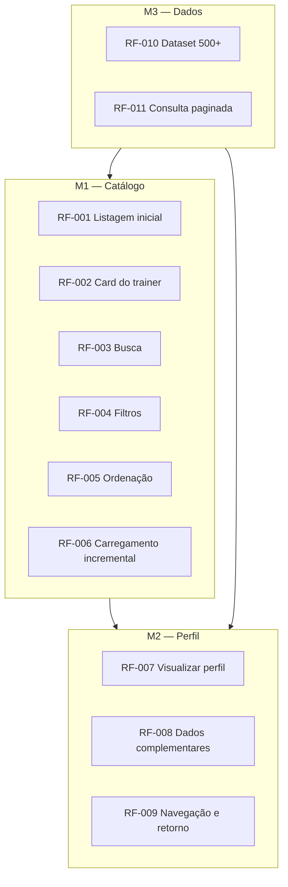

# Requisitos Funcionais — Fatal Trainer

**Produto:** Catálogo de personal trainers autônomos  
**Documento base:** [PRD.md](./PRD.md)  
**Versão:** 1.0  
**Segmento:** Personal trainers (musculação, funcional, emagrecimento, etc.)

---

## 1. Introdução

Este documento detalha os **requisitos funcionais (RF)** da aplicação **Fatal Trainer**, derivados do PRD. Cada requisito possui identificador único, descrição, prioridade (MoSCoW), regras de negócio e critérios de aceite verificáveis.

### 1.1 Convenções

| Campo | Significado |
|-------|-------------|
| **Must** | Obrigatório para entrega válida do teste |
| **Should** | Recomendado; aumenta qualidade da avaliação |
| **Could** | Opcional; implementar se houver tempo |
| **RN-** | Regra de negócio |
| **RF-** | Requisito funcional |

### 1.2 Atores

| Ator | Descrição |
|------|-----------|
| **Visitante** | Pessoa que acessa o catálogo sem autenticação |
| **Sistema** | Aplicação Nuxt (front-end + API mock/local) |

---

## 2. Visão geral dos módulos



---

## 3. Regras de negócio globais

| ID | Regra |
|----|-------|
| RN-001 | Todo personal trainer possui `id` único e imutável |
| RN-002 | O catálogo contém **no mínimo 500** registros de personal trainers |
| RN-003 | O valor exibido (`servicePrice`) refere-se ao **preço por sessão/aula** em BRL |
| RN-004 | A profissão/especialidade é um texto descritivo (ex.: "Personal Trainer — Funcional") |
| RN-005 | Busca considera correspondência parcial em **nome** ou **especialidade/profissão** (case insensitive) |
| RN-006 | Filtros, busca e ordenação podem ser **combinados** simultaneamente |
| RN-007 | A listagem **não** deve renderizar os 500 registros no DOM de uma vez |
| RN-008 | Personal trainer inexistente retorna estado de erro ou redirecionamento (404) |
| RN-009 | Avaliação (`rating`), quando presente, varia de **0 a 5** com até uma casa decimal |
| RN-010 | Distância (`distanceKm`), quando presente, é simulada e exibida em quilômetros |

---

## 4. Módulo M1 — Catálogo (listagem)

### RF-001 — Exibir listagem na página inicial

| Atributo | Valor |
|----------|-------|
| **Prioridade** | Must |
| **Atores** | Visitante, Sistema |
| **Pré-condição** | Dataset com ≥ 500 personal trainers disponível |
| **Pós-condição** | Primeiro lote de cards visível na rota `/` |

**Descrição:**  
Ao acessar a aplicação, o visitante visualiza a listagem de personal trainers em layout responsivo (mobile first).

**Critérios de aceite:**
- [ ] Rota `/` renderiza grid/lista de cards
- [ ] Carrega apenas o primeiro lote (conforme RF-006), não os 500 de uma vez
- [ ] Layout funcional em viewport ≥ 360px (mobile) e ≥ 1280px (desktop)

---

### RF-002 — Exibir card resumido do personal trainer

| Atributo | Valor |
|----------|-------|
| **Prioridade** | Must |
| **Atores** | Visitante, Sistema |
| **Pré-condição** | Personal trainer pertence ao conjunto filtrado/ordenado atual |

**Descrição:**  
Cada item da listagem apresenta um card com informações mínimas para comparação rápida.

**Campos obrigatórios no card:**

| Campo | Exemplo |
|-------|---------|
| Foto | Avatar/foto do trainer |
| Nome | "Ana Silva" |
| Profissão / especialidade | "Personal Trainer — HIIT" |
| Valor da sessão | "R$ 120,00" |

**Campos recomendados (Should):**

| Campo | Exemplo |
|-------|---------|
| Avaliação | ★ 4,8 (127) |
| Distância | 2,3 km |
| Modalidade | Presencial / Online / Híbrido |

**Critérios de aceite:**
- [ ] Os 4 campos obrigatórios estão visíveis em cada card
- [ ] Valor formatado em moeda brasileira (BRL)
- [ ] Foto com `alt` descritivo (ex.: "Foto de Ana Silva, personal trainer")
- [ ] Card é clicável/tocável e leva ao perfil (RF-007)

---

### RF-003 — Buscar personal trainers por nome ou especialidade

| Atributo | Valor |
|----------|-------|
| **Prioridade** | Must |
| **Atores** | Visitante, Sistema |
| **Regras** | RN-005, RN-006 |

**Descrição:**  
O visitante digita termos em um campo de busca para filtrar trainers por **nome** ou **profissão/especialidade**.

**Comportamento:**
- Input com debounce (150–300 ms)
- Busca vazia restaura listagem conforme filtros/ordenação ativos
- Termo com menos de 2 caracteres pode ignorar busca ou buscar normalmente (decisão documentada no README)

**Exemplos de busca válida:**

| Termo | Resultado esperado |
|-------|-------------------|
| "Ana" | Trainers cujo nome contém "Ana" |
| "funcional" | Trainers com especialidade contendo "funcional" |
| "crossfit" | Trainers com profissão/especialidade relacionada |

**Critérios de aceite:**
- [ ] Campo de busca visível no topo da listagem
- [ ] Resultados atualizam após debounce sem recarregar a página inteira
- [ ] Busca combinável com filtros (RF-004) e ordenação (RF-005)
- [ ] Zero resultados exibe empty state (RF-012)

---

### RF-004 — Filtrar resultados da listagem

| Atributo | Valor |
|----------|-------|
| **Prioridade** | Must |
| **Atores** | Visitante, Sistema |
| **Regras** | RN-006 |

**Descrição:**  
O visitante restringe a listagem por uma ou mais dimensões de filtro.

**Filtros mínimos (Must — implementar ≥ 1 dimensão):**

| Filtro | Tipo | Exemplo |
|--------|------|---------|
| Faixa de preço | Range min/max | R$ 80 – R$ 200 |
| Especialidade | Multi-select ou chips | Musculação, Funcional, CrossFit |
| Avaliação mínima | Select | ≥ 4,0 estrelas |
| Modalidade | Checkbox | Presencial, Online, Híbrido |
| Cidade | Select ou autocomplete | São Paulo, Rio de Janeiro |

**Filtros recomendados (Should):**

| Filtro | Tipo |
|--------|------|
| Distância máxima | Slider (km) |
| Certificação CREF | Sim/Não |

**Comportamento:**
- Aplicar filtro atualiza a listagem e reinicia paginação/infinite scroll
- Indicador visual de filtros ativos
- Ação "Limpar filtros" restaura estado padrão

**Critérios de aceite:**
- [ ] Pelo menos **1** dimensão de filtro funcional
- [ ] Filtros combináveis entre si e com busca (RF-003)
- [ ] Contagem ou feedback de resultados filtrados (ex.: "42 personal trainers")
- [ ] Limpar filtros retorna listagem completa (respeitando busca, se houver)

---

### RF-005 — Ordenar resultados da listagem

| Atributo | Valor |
|----------|-------|
| **Prioridade** | Must |
| **Atores** | Visitante, Sistema |
| **Regras** | RN-006 |

**Descrição:**  
O visitante ordena os cards por critérios relevantes para escolha de personal trainer.

**Critérios mínimos (Must — implementar ≥ 2):**

| Critério | Ordem |
|----------|-------|
| Preço da sessão | Menor → maior / Maior → menor |
| Avaliação | Maior → menor |
| Distância | Mais próximo → mais distante |
| Nome | A → Z |

**Critérios de aceite:**
- [ ] Seletor de ordenação acessível (dropdown ou chips)
- [ ] Ordenação aplicada sobre conjunto já filtrado/buscado
- [ ] Ordenação padrão definida (ex.: relevância ou distância) e documentada
- [ ] Troca de ordenação reinicia carregamento incremental do primeiro lote

---

### RF-006 — Carregar cards sob demanda

| Atributo | Valor |
|----------|-------|
| **Prioridade** | Must |
| **Atores** | Visitante, Sistema |
| **Regras** | RN-007 |

**Descrição:**  
A listagem carrega personal trainers incrementalmente para manter performance.

**Estratégias aceitas (escolher uma):**
- Scroll infinito (sentinel / Intersection Observer)
- Paginação numérica
- Botão "Carregar mais"

**Parâmetros sugeridos:**
- `pageSize`: 12–24 cards por lote
- Indicador de loading ao carregar próximo lote

**Critérios de aceite:**
- [ ] Primeiro lote carrega na abertura da página
- [ ] Novos lotes carregam sem duplicar cards
- [ ] Fim da lista indicado (mensagem ou ausência de trigger)
- [ ] DOM não contém 500 cards simultaneamente
- [ ] Busca/filtro/ordenação reinicia para lote 1

---

### RF-012 — Exibir estados vazios e de carregamento

| Atributo | Valor |
|----------|-------|
| **Prioridade** | Should |
| **Atores** | Visitante, Sistema |

**Descrição:**  
Feedback visual quando não há resultados ou durante carregamento.

**Estados:**

| Estado | Comportamento |
|--------|---------------|
| Loading inicial | Skeleton cards ou spinner na área da listagem |
| Loading próximo lote | Indicador no rodapé da lista |
| Empty search/filter | Mensagem + sugestão (ex.: "Nenhum personal trainer encontrado. Tente outros filtros.") |
| Erro de dados | Mensagem amigável + opção de tentar novamente |

**Critérios de aceite:**
- [ ] Empty state quando busca/filtro retorna zero resultados
- [ ] Skeleton ou loading no carregamento inicial (Should)
- [ ] Mensagens em português, claras e acionáveis

---

## 5. Módulo M2 — Perfil do personal trainer

### RF-007 — Visualizar perfil detalhado

| Atributo | Valor |
|----------|-------|
| **Prioridade** | Must |
| **Atores** | Visitante, Sistema |
| **Pré-condição** | Personal trainer com `id` válido existe no dataset |
| **Pós-condição** | Perfil exibido em página dedicada ou overlay |

**Descrição:**  
Ao selecionar um card, o visitante acessa o perfil completo do personal trainer.

**Formato recomendado:** página dedicada em `/personal-trainers/[id]` ou `/profissionais/[id]`.

**Campos obrigatórios (Must):**

| Campo | Descrição |
|-------|-----------|
| Foto | Imagem principal em destaque |
| Nome | Nome compleo ou nome profissional |
| Profissão | Especialidade principal |
| Descrição | Bio/sobre o profissional (texto livre, ≥ 50 caracteres sugerido) |
| Valor da sessão | Preço por aula/sessão em BRL |

**Campos opcionais do desafio (Should implementar ≥ 1):**

| Campo | Descrição |
|-------|-----------|
| Avaliação média | Nota 0–5 + quantidade de avaliações |
| Localização / distância | Cidade, bairro ou km simulado |

**Critérios de aceite:**
- [ ] Navegação a partir do card abre perfil correto
- [ ] URL compartilhável (deep link funciona)
- [ ] Todos os campos Must visíveis e legíveis
- [ ] ID inexistente → página 404 ou redirect com mensagem (RN-008)

---

### RF-008 — Exibir informações complementares no perfil

| Atributo | Valor |
|----------|-------|
| **Prioridade** | Should |
| **Atores** | Visitante, Sistema |

**Descrição:**  
Enriquecer o perfil com dados relevantes para contratação de personal trainer.

**Informações complementares (implementar ≥ 1):**

| Bloco | Conteúdo exemplo |
|-------|------------------|
| Especialidades / serviços | Musculação, Emagrecimento, Treino para idosos |
| Modalidades | Presencial (academia/domícilio), Online ao vivo |
| Certificações | CREF 012345-G/SP |
| Galeria | Fotos de treinos, antes/depois de alunos (simuladas) |
| Disponibilidade | Seg–Sex 6h–21h; Sáb 8h–12h |
| Avaliações | Lista de depoimentos com nota e texto |
| Experiência | "8 anos de experiência" |

**Critérios de aceite:**
- [ ] Pelo menos **1** bloco complementar renderizado quando dados existem
- [ ] Seção oculta ou omitida quando dado ausente (sem placeholder quebrado)
- [ ] Galeria com lazy load nas imagens (Could)

---

### RF-009 — Navegar entre listagem e perfil

| Atributo | Valor |
|----------|-------|
| **Prioridade** | Must |
| **Atores** | Visitante, Sistema |

**Descrição:**  
O visitante retorna à listagem preservando contexto quando possível.

**Comportamento:**
- Botão "Voltar" ou navegação via histórico do browser
- **Should:** filtros, busca, ordenação e posição de scroll persistidos via query string na URL ou `sessionStorage`

**Critérios de aceite:**
- [ ] Ação explícita de voltar disponível no perfil
- [ ] Histórico do browser funciona (back retorna à listagem)
- [ ] **Should:** estado de filtros/busca mantido ao voltar

---

### RF-013 — SEO do perfil

| Atributo | Valor |
|----------|-------|
| **Prioridade** | Should |
| **Atores** | Sistema |

**Descrição:**  
Meta tags dinâmicas por personal trainer.

**Critérios de aceite:**
- [ ] `<title>` inclui nome e especialidade (ex.: "Ana Silva — Personal Trainer Funcional | Fatal Trainer")
- [ ] Meta description com trecho da bio ou resumo
- [ ] Implementado via `useSeoMeta` (Nuxt)

---

## 6. Módulo M3 — Dados e consultas

### RF-010 — Manter catálogo com 500+ personal trainers

| Atributo | Valor |
|----------|-------|
| **Prioridade** | Must |
| **Atores** | Sistema |
| **Regras** | RN-001, RN-002 |

**Descrição:**  
Dataset local ou API mock com no mínimo 500 registros coerentes com o segmento personal trainer.

**Dados mínimos por registro:**

```typescript
{
  id: string;
  name: string;
  profession: string;      // ex.: "Personal Trainer — CrossFit"
  description: string;
  photoUrl: string;
  servicePrice: number;    // preço por sessão (BRL)
}
```

**Dados recomendados para o segmento:**

```typescript
{
  rating?: number;
  reviewCount?: number;
  distanceKm?: number;
  city?: string;
  state?: string;
  specialties?: string[];  // Musculação, Funcional, HIIT...
  modalities?: ('presencial' | 'online' | 'hibrido')[];
  cref?: string;
  gallery?: string[];
  availability?: string;
  experienceYears?: number;
}
```

**Critérios de aceite:**
- [ ] Contagem ≥ 500 verificável (script, log ou documentação)
- [ ] Especialidades variadas e realistas
- [ ] IDs únicos
- [ ] Origem dos dados documentada no README

---

### RF-011 — Consultar listagem com paginação e filtros

| Atributo | Valor |
|----------|-------|
| **Prioridade** | Must |
| **Atores** | Sistema |

**Descrição:**  
Camada de acesso (composable, store ou `server/api`) que retorna subset paginado aplicando busca, filtros e ordenação.

**Contrato sugerido:**

```
GET /api/personal-trainers?search=&specialty=&minPrice=&maxPrice=&minRating=&modality=&sortBy=&sortOrder=&page=&pageSize=
```

**Resposta:**

```typescript
{
  items: PersonalTrainer[];
  total: number;
  page: number;
  pageSize: number;
  hasMore: boolean;
}
```

**Critérios de aceite:**
- [ ] Retorna apenas `pageSize` itens por requisição
- [ ] `total` reflete filtros/busca aplicados
- [ ] Ordenação consistente entre páginas
- [ ] Tipagem TypeScript em request e response

---

## 7. Matriz de rastreabilidade

| RF | PRD | Caso de uso | Prioridade |
|----|-----|-------------|------------|
| RF-001 | E1.1 | UC-01 | Must |
| RF-002 | E1.3 | UC-01 | Must |
| RF-003 | E1.4 | UC-02 | Must |
| RF-004 | E1.5 | UC-03 | Must |
| RF-005 | E1.6 | UC-04 | Must |
| RF-006 | E1.7 | UC-05 | Must |
| RF-007 | E2.1, E2.2 | UC-06 | Must |
| RF-008 | E2.5 | UC-06 | Should |
| RF-009 | E2.6 | UC-07 | Must |
| RF-010 | E1.2, E3 | — | Must |
| RF-011 | E3 | UC-01–UC-05 | Must |
| RF-012 | E1.9, E1.10 | UC-02, UC-03 | Should |
| RF-013 | E2.7 | UC-06 | Should |

---

## 8. Checklist de verificação (Must)

- [ ] RF-001 — Listagem na `/`
- [ ] RF-002 — Card com foto, nome, profissão, valor
- [ ] RF-003 — Busca por nome ou especialidade
- [ ] RF-004 — Pelo menos 1 filtro
- [ ] RF-005 — Pelo menos 2 critérios de ordenação
- [ ] RF-006 — Carregamento incremental
- [ ] RF-007 — Perfil com campos obrigatórios
- [ ] RF-009 — Voltar à listagem
- [ ] RF-010 — Dataset ≥ 500 personal trainers
- [ ] RF-011 — Consulta paginada funcional

---

## 9. Histórico

| Versão | Data | Alterações |
|--------|------|------------|
| 1.0 | 2026-06-04 | Versão inicial — segmento personal trainer |
