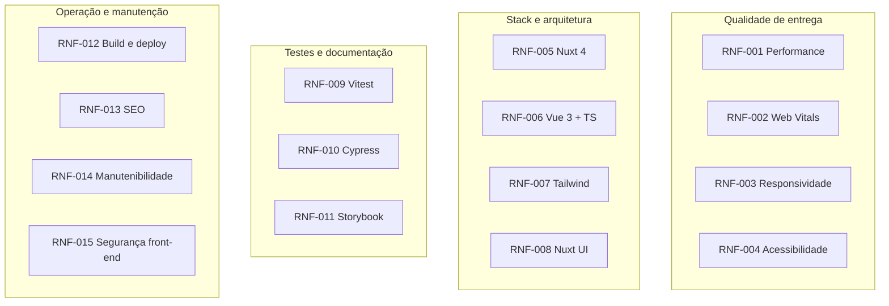

# Requisitos Não Funcionais — Fatal Trainer

**Produto:** Catálogo de personal trainers autônomos  
**Escopo:** Front-end  
**Documento base:** [PRD.md](./PRD.md) · [requisitos-funcionais.md](./requisitos-funcionais.md)  
**Versão:** 1.0

---

## 1. Introdução

Este documento especifica os **requisitos não funcionais (RNF)** da aplicação **Fatal Trainer**, com foco em qualidade técnica, experiência do usuário, performance, acessibilidade, testabilidade e manutenibilidade do front-end.

### 1.1 Convenções

| Prefixo | Significado |
|---------|-------------|
| **RNF-** | Requisito não funcional |
| **Must** | Obrigatório para entrega válida |
| **Should** | Recomendado; fortalece avaliação |
| **Could** | Opcional; implementar se houver tempo |

### 1.2 Stack tecnológica (obrigatória)

| Tecnologia | Papel no projeto |
|------------|------------------|
| **Nuxt 4** | Framework full-stack front-end (SSR/SSG, rotas, server routes) |
| **Vue 3** | UI reativa (Composition API, `<script setup>`) |
| **TypeScript** | Tipagem estática em componentes, composables e tipos de domínio |
| **Tailwind CSS** | Estilização utility-first, responsividade mobile first |
| **Nuxt UI** | Biblioteca de componentes acessíveis integrada ao ecossistema Nuxt |
| **Vitest** | Testes unitários e de integração leve (composables, utils, componentes) |
| **Cypress** | Testes end-to-end dos fluxos críticos (listagem → perfil) |
| **Storybook** | Documentação visual e desenvolvimento isolado de componentes |

---

## 2. Visão geral por categoria



---

## 3. Performance e Core Web Vitals

### RNF-001 — Tempo de resposta e carregamento eficiente

| Atributo | Valor |
|----------|-------|
| **Prioridade** | Must |
| **Categoria** | Performance |

**Descrição:**  
A aplicação deve carregar e responder de forma eficiente, especialmente em dispositivos móveis e conexões simuladas 4G.

**Metas orientativas:**

| Métrica | Meta (mobile) | Ferramenta |
|---------|---------------|------------|
| LCP | ≤ 2,5 s | Lighthouse |
| INP | ≤ 200 ms | Lighthouse / Web Vitals |
| CLS | ≤ 0,1 | Lighthouse |
| TTFB (SSR) | ≤ 800 ms | Lighthouse / Network |

**Requisitos:**
- Não incluir os 500 registros no bundle inicial da listagem
- Paginação ou scroll infinito com lotes de 12–24 itens
- Imagens abaixo da dobra com `loading="lazy"` e dimensões reservadas
- Preferir formatos modernos (WebP/AVIF) quando possível
- Debounce de 150–300 ms na busca para reduzir re-renderizações

**Critérios de aceite:**
- [ ] Primeiro lote da listagem visível sem carregar dataset completo no client
- [ ] Scores Lighthouse mobile documentados no README (mesmo que metas não sejam atingidas localmente)
- [ ] `nuxi analyze` ou equivalente executado; bundle comentado no README

---

### RNF-002 — Otimização para Core Web Vitals

| Atributo | Valor |
|----------|-------|
| **Prioridade** | Should |
| **Categoria** | Performance |

**Descrição:**  
Decisões de renderização, imagens e interação devem demonstrar consciência sobre LCP, INP e CLS.

**Ações obrigatórias (Should):**

| Vital | Ação |
|-------|------|
| LCP | Foto do primeiro card otimizada; evitar hero pesado na home |
| INP | Filtros e busca não bloqueiam thread principal; feedback imediato |
| CLS | Cards com `aspect-ratio` fixo; skeleton com mesma altura do card |

**Critérios de aceite:**
- [ ] README descreve estratégias adotadas para LCP, INP e CLS
- [ ] Cards não “pulam” layout ao carregar imagens
- [ ] Skeleton/loading ocupa mesmo espaço visual do conteúdo final

---

## 4. Responsividade e UX

### RNF-003 — Layout responsivo mobile first

| Atributo | Valor |
|----------|-------|
| **Prioridade** | Must |
| **Categoria** | Usabilidade / UI |

**Descrição:**  
Interface utilizável e agradável em mobile e desktop, projetada **mobile first** com Tailwind CSS.

**Breakpoints (Tailwind padrão):**

| Token | Largura | Comportamento |
|-------|---------|---------------|
| default | < 640px | Coluna única; filtros em bottom sheet/drawer |
| `sm` | ≥ 640px | Grid 2 colunas opcional |
| `md` | ≥ 768px | Grid 2–3 colunas |
| `lg` | ≥ 1024px | Sidebar de filtros; grid 3–4 colunas |

**Requisitos:**
- Viewport mínimo suportado: **360px** sem scroll horizontal
- Touch targets ≥ **44×44 px** em botões e chips (mobile)
- Tipografia legível (corpo ≥ 16px no mobile)
- Estados hover apenas onde fizer sentido (`@media (hover: hover)`)

**Critérios de aceite:**
- [ ] Listagem usável em 375×667 e 1280×800
- [ ] Filtros acessíveis no mobile sem ocupar tela inteira permanentemente
- [ ] Perfil legível sem zoom manual no mobile

---

### RNF-004 — Acessibilidade (a11y)

| Atributo | Valor |
|----------|-------|
| **Prioridade** | Should |
| **Categoria** | Acessibilidade |

**Descrição:**  
A aplicação deve ser navegável por teclado e compreensível por leitores de tela, aproveitando primitivos acessíveis do **Nuxt UI** quando aplicável.

**Requisitos:**

| Área | Requisito |
|------|-----------|
| Teclado | Cards focáveis; `Enter`/`Space` abre perfil |
| Foco | Indicador de focus visível (não remover outline sem substituto) |
| Formulários | Labels associados a busca e filtros |
| Imagens | `alt` descritivo em fotos de trainers |
| Contraste | WCAG 2.1 AA em textos e controles principais |
| Semântica | `main`, `nav`, headings hierárquicos (`h1` → `h2`) |
| Modais/sheets | Focus trap e `Esc` para fechar (Nuxt UI) |

**Critérios de aceite:**
- [ ] Navegação completa listagem → perfil → voltar apenas com teclado
- [ ] Lighthouse Accessibility ≥ 90 **ou** justificativa de gaps no README
- [ ] Nenhum controle crítico exclusively hover-only

---

## 5. Stack e frameworks

### RNF-005 — Nuxt 4

| Atributo | Valor |
|----------|-------|
| **Prioridade** | Must |
| **Categoria** | Arquitetura |

**Descrição:**  
Projeto baseado em **Nuxt 4** com TypeScript, file-based routing e server routes para API mock.

**Requisitos:**
- Nuxt 4.x como framework principal
- Rotas: `/` (listagem), `/personal-trainers/[id]` (perfil)
- Server route `server/api/personal-trainers.get.ts` para listagem paginada (recomendado)
- `useSeoMeta` / `useHead` nas páginas de listagem e perfil
- Auto-imports de composables e components conforme convenção Nuxt
- Configuração em `nuxt.config.ts` documentada

**Critérios de aceite:**
- [ ] `package.json` declara Nuxt 4
- [ ] `pnpm dev`, `pnpm build`, `pnpm preview` funcionam
- [ ] Deep link do perfil funciona (SSR ou prerender configurado)

---

### RNF-006 — Vue 3 + TypeScript

| Atributo | Valor |
|----------|-------|
| **Prioridade** | Must |
| **Categoria** | Arquitetura |

**Descrição:**  
Componentes Vue 3 com **Composition API** e `<script setup lang="ts">`; tipagem consistente em todo o front-end.

**Requisitos:**
- Composition API exclusiva (sem Options API em código novo)
- Tipos de domínio em `types/` (ex.: `PersonalTrainer`, `ListQuery`)
- Props e emits tipados com `defineProps` / `defineEmits`
- Composables para lógica reutilizável (`usePersonalTrainers`, `useTrainerFilters`)
- TypeScript `strict: true` no `tsconfig` (recomendado)
- Proibido `any` em código de produção (exceto justificado)

**Critérios de aceite:**
- [ ] Zero erros em `pnpm nuxi typecheck` (ou `vue-tsc`)
- [ ] Composables cobrem busca, filtro, ordenação e paginação
- [ ] Componentes de apresentação sem lógica de negócio pesada

---

### RNF-007 — Tailwind CSS

| Atributo | Valor |
|----------|-------|
| **Prioridade** | Must |
| **Categoria** | UI / Estilo |

**Descrição:**  
Estilização via **Tailwind CSS** com abordagem mobile first e design tokens alinhados ao Nuxt UI.

**Requisitos:**
- Módulo `@nuxtjs/tailwindcss` ou integração oficial compatível com Nuxt 4
- Utility classes como padrão; `@apply` apenas em casos justificados
- Responsividade via prefixos `sm:`, `md:`, `lg:`
- Tema estendido em `tailwind.config` se necessário (cores da marca Fatal Trainer)
- Purge/content paths configurados para produção enxuta
- Dark mode: Could (via Nuxt UI / `class` strategy)

**Critérios de aceite:**
- [ ] Sem CSS inline extensivo; estilos co-localizados ou Tailwind
- [ ] Layout mobile first verificável no código (classes base = mobile)
- [ ] Build de produção sem CSS não utilizado crítico (purge ativo)

---

### RNF-008 — Nuxt UI

| Atributo | Valor |
|----------|-------|
| **Prioridade** | Must |
| **Categoria** | UI / Componentes |

**Descrição:**  
Utilizar **Nuxt UI** como base de componentes (inputs, buttons, modals, drawers, skeletons) para consistência visual e acessibilidade.

**Componentes Nuxt UI recomendados:**

| Uso na aplicação | Componente Nuxt UI |
|------------------|-------------------|
| Busca | `UInput` |
| Filtros / ordenação | `USelect`, `UCheckbox`, `UButton`, `USlideover` |
| Cards / layout | `UCard`, `UBadge`, `UAvatar` |
| Loading | `USkeleton` |
| Empty state | composição com `UButton`, tipografia Nuxt UI |
| Paginação / load more | `UButton` |

**Requisitos:**
- Módulo `@nuxt/ui` configurado em `nuxt.config.ts`
- Componentes de domínio (`TrainerCard`, `TrainerFilters`) compõem primitivos Nuxt UI
- Customização via Tailwind / tokens Nuxt UI, não fork de componentes inteiros
- Tema coerente (primary, neutral) documentado no README

**Critérios de aceite:**
- [ ] Busca, filtros e botões principais usam Nuxt UI
- [ ] Visual consistente entre listagem e perfil
- [ ] Slideover/Modal Nuxt UI para filtros no mobile (Should)

---

## 6. Testes e qualidade

### RNF-009 — Testes unitários com Vitest

| Atributo | Valor |
|----------|-------|
| **Prioridade** | Should |
| **Categoria** | Testabilidade |

**Descrição:**  
Testes automatizados com **Vitest** para lógica crítica e componentes isolados.

**Escopo mínimo de testes (Should):**

| Alvo | Exemplos |
|------|----------|
| Composables | `usePersonalTrainers`, `useTrainerFilters` — filtro, sort, paginação |
| Utils | formatação de preço BRL, normalização de busca |
| Componentes | `TrainerCard` renderiza props; empty state |

**Requisitos:**
- Vitest configurado com `@vue/test-utils` e ambiente `happy-dom` ou `jsdom`
- Script `pnpm test` (ou `pnpm test:unit`) no `package.json`
- Cobertura não é meta rígida; foco em caminhos críticos
- Mocks para fetch/API em testes de composables

**Critérios de aceite:**
- [ ] `pnpm test` executa e passa no CI/local
- [ ] ≥ 1 suite de composable (filtro/busca/sort)
- [ ] ≥ 1 teste de componente ou util
- [ ] README documenta como rodar testes unitários

---

### RNF-010 — Testes E2E com Cypress

| Atributo | Valor |
|----------|-------|
| **Prioridade** | Should |
| **Categoria** | Testabilidade |

**Descrição:**  
Testes end-to-end com **Cypress** cobrindo jornadas principais mapeadas nos casos de uso.

**Cenários E2E mínimos (Should):**

| ID | Jornada | UC |
|----|---------|-----|
| E2E-01 | Abrir listagem → ver cards | UC-01 |
| E2E-02 | Buscar trainer por nome | UC-02 |
| E2E-03 | Aplicar filtro e ver resultados | UC-03 |
| E2E-04 | Abrir perfil a partir do card | UC-06 |
| E2E-05 | Voltar à listagem | UC-07 |

**Requisitos:**
- Cypress configurado (Component optional; E2E obrigatório no escopo Should)
- Script `pnpm test:e2e` inicia app ou usa `baseUrl` configurada
- `data-testid` ou seletores estáveis em elementos críticos (cards, busca, perfil)
- Screenshots/vídeo on failure habilitados localmente

**Critérios de aceite:**
- [ ] ≥ 3 specs E2E passando (incluindo listagem → perfil)
- [ ] README documenta `pnpm test:e2e`
- [ ] Specs independentes e repetíveis

---

### RNF-011 — Storybook

| Atributo | Valor |
|----------|-------|
| **Prioridade** | Should |
| **Categoria** | Documentação / UI |

**Descrição:**  
**Storybook** para desenvolvimento isolado e documentação visual dos componentes de domínio e UI.

**Stories mínimas (Should):**

| Componente | Stories |
|------------|---------|
| `TrainerCard` | default, com avaliação, long name, loading |
| `TrainerFilters` | closed, open, with active filters |
| `TrainerList` | with items, empty, loading |
| UI states | EmptyState, skeleton (se custom) |

**Requisitos:**
- Storybook compatível com Vue 3 + Vite
- Integração com Tailwind e Nuxt UI (theme decorators)
- Script `pnpm storybook` no `package.json`
- Controls para props principais (nome, preço, rating)
- Documentação autodocs ou MDX breve por componente chave

**Critérios de aceite:**
- [ ] Storybook inicia localmente sem erro
- [ ] ≥ 3 componentes com stories documentadas
- [ ] README menciona como abrir Storybook

---

## 7. SEO, build e operação

### RNF-012 — Build, deploy e ambientes

| Atributo | Valor |
|----------|-------|
| **Prioridade** | Must |
| **Categoria** | DevOps front-end |

**Descrição:**  
Pipeline de build reproduzível e deploy da aplicação estática ou SSR em plataforma hospedada.

**Requisitos:**
- Node.js LTS documentado (ex.: 20.x)
- Gerenciador de pacotes: `pnpm` (recomendado) ou `npm` — consistente no README
- Scripts: `dev`, `build`, `preview`, `lint`, `test`, `test:e2e`, `storybook`
- Build de produção sem erros TypeScript
- Deploy público (Vercel, Netlify, Cloudflare Pages, etc.)
- Variáveis de ambiente documentadas (se houver)

**Critérios de aceite:**
- [ ] `pnpm build` conclui com sucesso
- [ ] URL pública funcional enviada no formulário de entrega
- [ ] README com passos clone → install → dev → build

---

### RNF-013 — SEO técnico

| Atributo | Valor |
|----------|-------|
| **Prioridade** | Should |
| **Categoria** | SEO |

**Descrição:**  
Páginas indexáveis com metadados adequados para listagem e perfis de personal trainers.

**Requisitos:**
- `<title>` e `meta description` dinâmicos no perfil (RF-013)
- Listagem com title padrão: "Fatal Trainer — Encontre seu personal trainer"
- Open Graph básico: `og:title`, `og:description`, `og:image` no perfil (Could)
- URLs semânticas: `/personal-trainers/[id]`
- HTML semântico (`h1` único por página)

**Critérios de aceite:**
- [ ] View source do perfil exibe meta tags corretas
- [ ] `lang="pt-BR"` no HTML

---

## 8. Manutenibilidade e qualidade de código

### RNF-014 — Manutenibilidade e padrões de código

| Atributo | Valor |
|----------|-------|
| **Prioridade** | Must |
| **Categoria** | Manutenibilidade |

**Descrição:**  
Código legível, consistente e fácil de evoluir por outro desenvolvedor.

**Requisitos:**
- ESLint + Prettier (ou `@nuxt/eslint`) configurados
- Estrutura de pastas documentada no README
- Nomenclatura em inglês no código; UI em português
- Componentes pequenos e focados (< ~200 linhas como guia)
- Composables extraídos quando lógica é reutilizada ou testável
- ADR ou seção "Decisões técnicas" no README

**Critérios de aceite:**
- [ ] `pnpm lint` passa (ou equivalente)
- [ ] Estrutura `components/`, `composables/`, `types/`, `pages/` evidente
- [ ] Decisões sobre dados, paginação e Nuxt UI documentadas

---

### RNF-015 — Segurança no front-end

| Atributo | Valor |
|----------|-------|
| **Prioridade** | Should |
| **Categoria** | Segurança |

**Descrição:**  
Boas práticas básicas para aplicação front-end pública.

**Requisitos:**
- Sanitização: não usar `v-html` com conteúdo não confiável
- Links externos: `rel="noopener noreferrer"` quando `target="_blank"`
- Sem secrets ou tokens em repositório (`.env` no `.gitignore`)
- Dependências auditadas: `pnpm audit` ou nota no README
- Headers de deploy documentados se configurados (Could)

**Critérios de aceite:**
- [ ] Nenhum `.env` com secrets commitado
- [ ] Descrições de trainers renderizadas como texto, não HTML cru

---

## 9. Compatibilidade

### RNF-016 — Compatibilidade de navegadores

| Atributo | Valor |
|----------|-------|
| **Prioridade** | Should |
| **Categoria** | Compatibilidade |

**Browsers alvo:**

| Browser | Versão |
|---------|--------|
| Chrome / Edge | Últimas 2 versões |
| Firefox | Últimas 2 versões |
| Safari (iOS e macOS) | Últimas 2 versões |

**Critérios de aceite:**
- [ ] Fluxo principal testado manualmente em Chrome mobile e desktop
- [ ] Sem erros de console críticos na listagem e perfil

---

## 10. Matriz de rastreabilidade

| RNF | PRD | Prioridade | Ferramenta / stack |
|-----|-----|------------|----------------------|
| RNF-001 | §9.1 | Must | Nuxt, lazy load |
| RNF-002 | §9.1 | Should | Lighthouse |
| RNF-003 | §9.3 | Must | Tailwind |
| RNF-004 | §9.2 | Should | Nuxt UI, a11y |
| RNF-005 | §8 | Must | Nuxt 4 |
| RNF-006 | §8 | Must | Vue 3, TS |
| RNF-007 | §8 | Must | Tailwind CSS |
| RNF-008 | §8 | Must | Nuxt UI |
| RNF-009 | §10 Fase 3 | Should | Vitest |
| RNF-010 | §13 | Should | Cypress |
| RNF-011 | — | Should | Storybook |
| RNF-012 | §14 | Must | Nuxt build |
| RNF-013 | RF-013 | Should | useSeoMeta |
| RNF-014 | §9.4 | Must | ESLint |
| RNF-015 | — | Should | — |
| RNF-016 | — | Should | — |

---

## 11. Scripts esperados (`package.json`)

```json
{
  "scripts": {
    "dev": "nuxt dev",
    "build": "nuxt build",
    "preview": "nuxt preview",
    "lint": "eslint .",
    "typecheck": "nuxt typecheck",
    "test": "vitest run",
    "test:watch": "vitest",
    "test:e2e": "cypress run",
    "test:e2e:open": "cypress open",
    "storybook": "storybook dev -p 6006",
    "build-storybook": "storybook build"
  }
}
```

---

## 12. Checklist consolidado

### Must (obrigatório)

- [ ] RNF-001 — Carregamento eficiente / incremental
- [ ] RNF-003 — Mobile first responsivo
- [ ] RNF-005 — Nuxt 4 configurado
- [ ] RNF-006 — Vue 3 + TypeScript strict
- [ ] RNF-007 — Tailwind CSS
- [ ] RNF-008 — Nuxt UI nos controles principais
- [ ] RNF-012 — Build e deploy
- [ ] RNF-014 — Lint, estrutura, README

### Should (recomendado)

- [ ] RNF-002 — Web Vitals documentados
- [ ] RNF-004 — Acessibilidade teclado + Lighthouse a11y
- [ ] RNF-009 — Vitest com composables testados
- [ ] RNF-010 — Cypress E2E jornada principal
- [ ] RNF-011 — Storybook com ≥ 3 componentes
- [ ] RNF-013 — SEO meta dinâmico
- [ ] RNF-015 — Boas práticas de segurança front-end
- [ ] RNF-016 — Browsers alvo verificados

---

## 13. Histórico

| Versão | Data | Alterações |
|--------|------|------------|
| 1.0 | 2026-06-04 | Versão inicial — stack Nuxt 4, Vitest, Cypress, Storybook, Tailwind, Nuxt UI |
