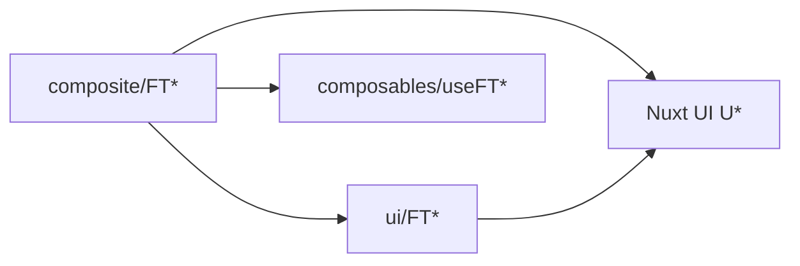
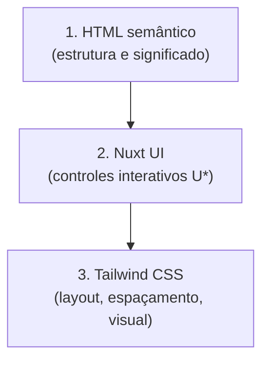

# Especificação — Biblioteca de componentes FT

**Versão:** 1.3  
**Status:** Normativo  
**Documentos base:** [estrutura-pastas.md](./estrutura-pastas.md) · [prd-design.md](../prd-design.md) · [design/fatal-trainer.pen](../../design/fatal-trainer.pen)

---

## 1. Objetivo

Este documento define **como criar, organizar e manter** os componentes da interface Fatal Trainer:

- convenções de nomenclatura e pastas;
- diferença entre primitivos (`ui/`) e compostos (`composite/`);
- pilares de implementação: **Nuxt UI** + **HTML semântico** + **Tailwind CSS**;
- arquivos obrigatórios (Vue, testes, Storybook);
- sincronização obrigatória com o design em Pencil (`.pen`).

Qualquer componente novo ou alterado no projeto deve seguir esta especificação.

---

## 2. Nomenclatura

| Regra | Detalhe |
|-------|---------|
| Prefixo | Sempre `FT` + nome em PascalCase (`FTAvatar`, `FTTrainerCard`) |
| Código | Inglês (props, composables, pastas) |
| Texto visível | Português (labels, mensagens, placeholders) |
| Pasta | Mesmo nome do componente: `FTAvatar/FTAvatar.vue` |
| Auto-import Nuxt | Nome do componente = nome da pasta (`FTAvatar`), sem prefixo `Ui` — ver `nuxt.config.ts` (`pathPrefix: false`) |

---

## 3. Onde colocar cada componente

### 3.1 Primitivos — `app/components/ui/`

**Critério:** um único papel visual; dados via **props**; **não** importa outros componentes `FT*` (pode usar Nuxt UI e utilitários).

| Exemplos | Papel |
|----------|--------|
| `FTAvatar` | Avatar / iniciais |
| `FTIconButton` | Botão ícone (ação ou link) |
| `FTPriceLabel`, `FTRatingBadge`, `FTStarRating` | Preço e avaliação |
| `FTModalityBadge`, `FTDistanceLabel` | Badge e metadado |
| `FTSearchInput` | Campo de busca |
| `FTActiveFilterChip` | Chip removível |
| `FTSectionHeading`, `FTProfileSection` | Título e bloco de seção |
| `FTResultsCounter`, `FTLoadMoreSentinel` | Contador e rodapé de loading |
| `FTTrainerCardSkeleton` | Placeholder de skeleton |
| `FTBackLink` | Navegação voltar |
| `FTGradientBubbles` | Decoração de fundo |

### 3.2 Compostos — `app/components/composite/`

**Critério:** monta **um ou mais** primitivos `FT*` e/ou orquestra estado com composable `useFT*` (API, URL, filtros).

| Subpasta | Exemplos |
|----------|----------|
| `common/` | `FTEmptyState`, `FTErrorState` |
| `catalog/` | `FTTrainerCard`, `FTTrainerList`, `FTFilterPanel`, `FTCatalogToolbar`, … |
| `profile/` | `FTProfileHeader`, `FTProfileHero`, `FTProfileGallery`, … |

### 3.3 Regra de dependência



- **Permitido:** `composite/**` → `ui/**`, `composables/components/useFT*`, Nuxt UI.
- **Proibido:** `ui/**` → `composite/**`.
- **Proibido:** lógica de negócio pesada ou `$fetch` direto em `.vue` de UI; usar composables.

---

## 4. Estrutura de arquivos (obrigatória)

Cada componente FT vive em **sua própria pasta**, com **três arquivos** de mesmo nome:

```
app/components/{ui|composite}/<contexto>/FT<Nome>/
  FT<Nome>.vue           # Single File Component
  FT<Nome>.spec.ts       # Testes unitários (Vitest)
  FT<Nome>.stories.ts    # Documentação visual (Storybook)
```

| Arquivo | Responsabilidade |
|---------|------------------|
| `FT<Nome>.vue` | Template + script setup; tipagem TypeScript |
| `FT<Nome>.spec.ts` | Comportamento e render mínimo; usar `tests/helpers/mount-ft.ts` quando precisar de mount |
| `FT<Nome>.stories.ts` | Variantes visuais; título `UI/...` ou `Composite/<Contexto>/...` |

**Composables de composite** (quando houver orquestração):

```
app/composables/components/useFT<Nome>.ts
```

- Prefixo `useFT` alinhado ao componente (`useFTTrainerList` ↔ `FTTrainerList`).
- Composables de **domínio** (`usePersonalTrainers`, `useTrainerFilters`) permanecem em `app/composables/catalog/` ou `profile/`; `useFT*` apenas encapsula uso na UI.

**Composables genéricos / transversais** (sem prefixo `FT`, reutilizáveis entre contextos):

```
app/composables/core/use<Nome>.ts
```

- Para utilitários de baixo nível, agnósticos de domínio (`useLocalStorage`, `useGeoLocation`).
- Devem ser **SSR-safe**, tipados e testáveis em isolamento; sem dependência de `FT*`.
- Geolocalização segue o padrão de **resolver plugável** (`useGeoLocation`): coords → cidade via resolver injetável, com fallback `manual` quando offline/sem correspondência.

---

## 5. Pilares de implementação (obrigatório)

Todo componente FT é construído combinando **três camadas**, nesta ordem:



| Pilar | Papel | Não substitui |
|-------|-------|---------------|
| **HTML semântico** | Landmarks, headings, listas, `button` vs `a` | Controles estilizados do Nuxt UI |
| **Nuxt UI** | Botões, inputs, selects, badges, modals, drawers acessíveis | Estrutura de página nem layout de grid |
| **Tailwind CSS** | Utilitários de layout, cor, tipografia, responsividade | Semântica nem comportamento de formulário |

> **Regra de ouro:** estrutura semântica primeiro → primitivos `U*` para interação → classes Tailwind para aparência. Nenhum pilar compensa a ausência do outro.

Referências: [RNF-004](../requisitos-nao-funcionais.md) (a11y) · [prd-design.md](../prd-design.md) §3 (tokens) · `app/assets/css/theme.css` · `app.config.ts`

### 5.1 HTML semântico

> **Escolha sempre o elemento HTML que descreve o papel do conteúdo.** Use `div` e `span` apenas para agrupamento visual ou hooks de layout quando não existir elemento semântico adequado.

- **ARIA complementa** o HTML semântico; não corrige `div`/`span` usados como botão, link ou título.
- **Nuxt UI** já renderiza tags corretas (`button`, `input`, etc.) — encaixe os `U*` dentro da estrutura semântica, não o contrário.

#### Mapa de elementos

| Papel | Elemento | Quando usar | Exemplo no projeto |
|-------|----------|-------------|-------------------|
| Navegação global ou local | `<nav>` | Conjunto de links de navegação | `FTAppHeader` (links desktop) |
| Cabeçalho de região | `<header>` | Título + ações de uma área | `FTCatalogToolbar`, hero do perfil |
| Conteúdo principal | `<main>` | Corpo da página (em layouts/pages) | `layouts/default.vue` |
| Seção temática | `<section>` | Bloco com tema próprio e título | `FTProfileSection`, blocos de filtros |
| Item autocontido | `<article>` | Card, review, item de feed reutilizável | `FTFeaturedTrainerCard`, reviews |
| Lista | `<ul>` / `<ol>` + `<li>` | Coleção ordenada ou não de itens | `FTTrainerList`, chips ativos |
| Título | `<h1>`–`<h6>` | Hierarquia de headings; sem saltos de nível | `FTSectionHeading` → `h2` |
| Ação | `<button>` | Clique que **não** navega (submit, dismiss, toggle) | dismiss de chip, FAB, ícones de ação |
| Navegação | `<a>` / `NuxtLink` | Ir para outra rota ou âncora | `FTTrainerCard`, `FTBackLink` |
| Formulário | `<form>`, `<label>`, campos nativos | Busca, filtros, login | `FTSearchInput` |
| Imagem | `` (ou avatar com `alt`) | Fotos e ilustrações informativas | `FTAvatar` |
| Data/hora | `<time datetime="…">` | Datas de review, publicação | listas de avaliação |
| Figura | `<figure>` + `<figcaption>` | Imagem com legenda | galeria do perfil |
| Estado assistivo | `role="status"` | Loading/empty sem texto suficiente | `FTEmptyState` |

#### Regras

| Regra | Detalhe |
|-------|---------|
| **Proibido** | `div` ou `span` com `@click` simulando botão ou link |
| Links | `NuxtLink` / `<a href>` para navegação; **nunca** `button` para mudar de rota |
| Botões | `type="button"` (ou `submit` dentro de `<form>`); sem texto visível → `aria-label` |
| Títulos | Hierarquia lógica (`h1` → `h2` → `h3`); componente documenta o nível fixo ou prop `headingLevel` |
| Seções | Toda `<section>` e `<article>` com heading visível ou `aria-labelledby` apontando para o título |
| Listas | Coleções repetíveis → `ul`/`ol` > `li`; cada `li` pode envolver um `article` ou card |
| Imagens | `alt` descritivo; decorativas → `alt=""` |
| Tabelas | `<table>` somente para dados tabulares; **nunca** para layout de card/lista |
| Landmarks duplicados | Um `<main>` por página; `<header>`/`<nav>` por região, não aninhados sem necessidade |

### 5.2 Nuxt UI

Usar primitivos **`U*`** do Nuxt UI v3+ como base de **controles interativos** e feedback. Não fazer fork de componentes inteiros.

| Controle | Primitivo Nuxt UI | Evitar |
|----------|-------------------|--------|
| Botão / link de ação | `UButton` (`to` para navegação interna) | `<button>` estilizado manualmente quando `UButton` cobre o caso |
| Campo de texto | `UInput`, `UTextarea` | `<input>` cru sem label/a11y |
| Seleção | `USelect`, `USelectMenu` | `<select>` custom com `div` |
| Badge / chip | `UBadge` | `<span>` com fundo colorido |
| Avatar | `UAvatar` (via `FTAvatar`) | `` circular sem fallback |
| Modal / drawer | `UModal`, `UDrawer`, `USlideover` | overlay manual com `div` fixo |
| Formulário | `UFormField` + campo `U*` | label solto sem associação |
| Feedback | `UToast`, `UAlert`, `USkeleton` | spinner/texto ad hoc |

| Regra | Detalhe |
|-------|---------|
| Customização | Props `color`, `variant`, `size` e slot `:ui` — não copiar markup interno do Nuxt UI |
| Cores | `color="primary"` e tokens de `theme.css`; ver `app.config.ts` |
| Ícones | `icon="i-lucide-*"` via Nuxt Icon |
| Composição | `FT*` encapsula e estende `U*`; composite monta `FT*` + `U*` quando necessário |

### 5.3 Tailwind CSS

Tailwind CSS v4 aplica **layout e visual** sobre a estrutura semântica e os primitivos Nuxt UI.

| Regra | Detalhe |
|-------|---------|
| Utilitários | Classes no `template` para flex, grid, gap, padding, cor, tipografia, responsividade |
| Tokens | Preferir variáveis do tema (`text-(--ft-primary)`, `bg-primary`, `text-slate-900`) e [prd-design.md](../prd-design.md) §3 |
| Import | `@import "tailwindcss"` em `app/assets/css/main.css` |
| Classes globais | Reutilizar utilitários de projeto (`.search-pill`, `.btn-fab`, …) quando já existirem |
| `<style scoped>` | Somente para seletores complexos, overrides de `U*` ou animações não triviais |
| **Proibido** | `style` inline, exceto valores dinâmicos inevitáveis (ex.: cor calculada) |
| **Proibido** | CSS customizado que duplique utilitários Tailwind já usados no projeto |

### 5.4 Composição dos três pilares

Padrões de referência — **semântico + Nuxt UI + Tailwind** no mesmo componente:

**Filtros (sidebar):**

```vue
<aside class="hidden lg:flex lg:flex-col lg:gap-4">
  <FTSectionHeading spacing="sm">{{ $t('catalog.filters') }}</FTSectionHeading>
  <UFormField :label="$t('catalog.sortBy')">
    <USelect
      v-model="sortKey"
      :items="sortItems"
      :ui="{ base: 'rounded-2xl' }"
    />
  </UFormField>
</aside>
```

**Card clicável (catálogo):**

```vue
<article>
  <NuxtLink
    :to="`/personal-trainers/${trainer.id}`"
    class="group flex min-h-[120px] items-start gap-4 border-b border-slate-100 py-5 transition-colors hover:bg-slate-50/50"
    :aria-label="$t('catalog.viewProfile', { name: trainer.name })"
  >
    <FTAvatar :src="trainer.photoUrl" :name="trainer.name" size="lg" />
    <div class="min-w-0 flex-1">
      <p class="text-xs font-medium uppercase tracking-wide text-slate-400">{{ trainer.profession }}</p>
      <h2 class="mt-0.5 truncate text-base font-bold text-slate-900">{{ trainer.name }}</h2>
      <FTPriceLabel :price="trainer.servicePrice" class="mt-2" />
      <div class="mt-2 flex flex-wrap items-center gap-2">
        <UBadge v-for="m in trainer.modalities" :key="m" color="neutral" variant="subtle">{{ m }}</UBadge>
      </div>
    </div>
  </NuxtLink>
</article>
```

**Lista de itens:**

```vue
<ul class="divide-y divide-slate-100">
  <li v-for="trainer in trainers" :key="trainer.id">
    <FTTrainerCard :trainer="trainer" />
  </li>
</ul>
```

**CTA com Nuxt UI + Tailwind:**

```vue
<UButton
  color="primary"
  block
  class="rounded-full"
  @click="applyFilters"
>
  {{ $t('catalog.applyFilters') }}
</UButton>
```

**Seção com título e campo Nuxt UI:**

```vue
<section :aria-labelledby="headingId" class="flex flex-col gap-4">
  <FTSectionHeading :id="headingId">{{ $t('catalog.filters') }}</FTSectionHeading>
  <UFormField :label="$t('catalog.sortBy')">
    <USelect v-model="sortKey" :items="sortItems" :ui="{ base: 'rounded-2xl' }" />
  </UFormField>
</section>
```

**Ação vs navegação (anti-padrão):**

```vue
<!-- Correto -->
<button type="button" class="rounded-full p-2 hover:bg-slate-100" :aria-label="label" @click="dismiss">…</button>
<UButton variant="ghost" color="primary" :to="profileUrl">…</UButton>

<!-- Incorreto — falta semântica e/ou primitivo -->
<div class="cursor-pointer" @click="dismiss">…</div>
<div class="bg-violet-600 px-4 text-white" @click="submit">Enviar</div>
```

### 5.5 Testes e Storybook

- Specs assertam a **tag semântica principal** (`find('article')`, `find('nav')`, `find('button')`).
- Quando o componente usa `U*`, stubar o primitivo Nuxt UI em testes — não remover a camada semântica externa.
- Stories variam dados e estados visuais; **não** alteram estrutura semântica nem trocam `U*` por markup manual.

---

## 6. Implementação — primitivos (UI)

### 6.1 Padrão SFC

```vue
<script setup lang="ts">
const props = withDefaults(defineProps<{
  label: string
  size?: 'sm' | 'md'
}>(), {
  size: 'md',
})

const emit = defineEmits<{
  click: []
}>()
</script>

<template>
  <section class="flex flex-col gap-3">
    <h2 class="text-lg font-semibold text-slate-900">{{ label }}</h2>
    <UButton color="primary" variant="soft" @click="emit('click')">
      {{ label }}
    </UButton>
  </section>
</template>
```

### 6.2 Regras

| Regra | Detalhe |
|-------|---------|
| Dados | Sempre **props** tipadas; `emit` para interação |
| Estado | Apenas `computed` local derivado de props |
| Pilares | Seguir §5 — HTML semântico + `U*` + Tailwind, nesta ordem |
| Nuxt UI | Controles via `UButton`, `UInput`, `UBadge`, `UAvatar`, etc. |
| Estilo | Tailwind + tokens (`theme.css`); classes globais quando existirem |
| A11y | `aria-label`, roles e `data-testid` kebab-case quando aplicável |
| i18n | Strings visíveis em português no template |

### 6.3 Testes (UI)

- Cobrir render com props default e pelo menos uma variante relevante.
- Exemplo: `FTPriceLabel` deve exibir `R$` e texto "por sessão".

### 6.4 Storybook (UI)

- `title`: `UI/FT<Nome>` (ex.: `UI/FTAvatar`).
- Mínimo: story `Default` + uma variante de borda (estado vazio, tamanho grande, texto longo, etc.).

---

## 7. Implementação — compostos (Composite)

### 7.1 Padrão SFC

```vue
<script setup lang="ts">
const { trainers, pending, isEmpty, clearFilters } = useFTTrainerList()
</script>

<template>
  <section>
    <FTEmptyState v-if="isEmpty" ... />
    <ul v-else class="divide-y divide-slate-100">
      <li v-for="t in trainers" :key="t.id">
        <FTTrainerCard :trainer="t" />
      </li>
    </ul>
  </section>
</template>
```

### 7.2 Regras

| Regra | Detalhe |
|-------|---------|
| Dados | Preferir **composable `useFT*`** no `setup`; evitar props para payload de API |
| Props permitidas | Apenas wiring: `mode`, flags de layout, `id` de rota quando inevitável |
| Pilares | Seguir §5 — landmarks + `ul`/`li`; `U*` para drawers/selects; Tailwind para layout |
| Composição | Montar primitivos `ui/FT*` e `U*`; não duplicar markup de primitivos inline |
| Pages | Páginas finas: importam composites; sem `watch` de filtros/API na page se já estiver no `useFT*` |

### 7.3 Testes (Composite)

- Spec mínimo: componente e composable exportados/definidos.
- Quando possível: testar composable em `tests/unit/composables/` com mocks de rota/fetch.
- Estados críticos (loading, empty, error) devem ter stories dedicadas.

### 7.4 Storybook (Composite)

- `title`: `Composite/<Contexto>/FT<Nome>` (ex.: `Composite/Catalog/FTTrainerList`).
- Decorator fullscreen (já configurado em `.storybook/preview.ts` para `Composite/*`).

---

## 8. Stack e tokens

Os três pilares (§5) apoiam-se nesta stack:

| Camada | Uso |
|--------|-----|
| **Nuxt UI v3+** | Primitivos `U*` — ver §5.2 |
| **Tailwind CSS v4** | Utilitários de estilo — ver §5.3 |
| **HTML semântico** | Estrutura de landmarks e conteúdo — ver §5.1 |
| **Tokens** | `app/assets/css/theme.css`, `app.config.ts`; paleta em [prd-design.md](../prd-design.md) §3 |
| **Ícones** | Lucide via Nuxt Icon (`i-lucide-*`) |

---

## 9. Sincronização código ↔ design (`.pen`)

O arquivo **[design/fatal-trainer.pen](../../design/fatal-trainer.pen)** é o mockup hi-fi oficial (Pencil). **Código e `.pen` devem permanecer alinhados.**

### 9.1 Princípio

> **Toda criação ou alteração de componente FT exige atualização nos dois lugares:** implementação Vue **e** representação no `.pen` (e vice-versa).

Não existe “só código” nem “só design” para componentes da biblioteca FT.

### 9.2 Fluxo A — Componente criado no código primeiro

1. Implementar em `app/components/ui/` ou `composite/` conforme §3, com `.vue`, `.spec.ts`, `.stories.ts`.
2. Abrir `design/fatal-trainer.pen` no **Pencil** (não editar o `.pen` como texto).
3. Criar ou atualizar o nó **reusable** com o **mesmo nome** (`FTAvatar`, `FTTrainerCard`, …).
4. Aplicar tokens do [prd-design.md](../prd-design.md) (cores, tipografia, espaçamento).
5. Posicionar o componente nas telas afetadas (T-01 catálogo, T-02 perfil, etc.).
6. Validar visualmente: Storybook ↔ screenshot do Pencil.
7. Commitar **código + `.pen`** no mesmo PR sempre que possível.

### 9.3 Fluxo B — Componente criado no `.pen` primeiro

1. Desenhar o componente reusable no Pencil com nome `FT<Nome>`.
2. Criar a pasta e os três arquivos no repositório conforme §4.
3. Implementar seguindo §5–§7 e [prd-design.md](../prd-design.md) §4 (anatomia).
4. Adicionar stories cobrindo variantes desenhadas no `.pen`.
5. Commitar **`.pen` + código** juntos.

### 9.4 Fluxo C — Alteração em componente existente

| Onde mudou primeiro | Ação obrigatória |
|---------------------|------------------|
| Código (props, layout, cor) | Atualizar instância/reusable no `.pen` |
| `.pen` (visual, spacing) | Atualizar `FT<Nome>.vue` e stories |
| Ambos | Manter nomes `FT*` idênticos; revisar dependentes (composites que usam o primitivo) |

### 9.5 Convenções no Pencil

| Aspecto | Convenção |
|---------|-----------|
| Nome do reusable | Igual ao componente Vue: `FTAvatar`, `FTTrainerCard` |
| Variantes | Refletir stories do Storybook (default, empty, loading, etc.) |
| Telas | Frames T-01, T-02 conforme [prd-design.md](../prd-design.md) §2 |
| Regeneração em lote | `node design/generate-pen.mjs` — ver [design/README.md](../../design/README.md); não substitui ajuste fino manual no Pencil |
| Leitura programática | Usar **Pencil MCP** no editor; **não** abrir `.pen` com `Read`/grep (formato criptografado) |

### 9.6 Checklist de sincronização (obrigatório no PR)

- [ ] Componente `FT<Nome>` existe em `ui/` ou `composite/` com `.vue`, `.spec.ts`, `.stories.ts`
- [ ] Implementação segue §5 (Nuxt UI + HTML semântico + Tailwind)
- [ ] Reusable ou instância correspondente existe em `design/fatal-trainer.pen`
- [ ] Nome idêntico entre código e Pencil
- [ ] Storybook atualizado (variantes novas)
- [ ] `npm test` e `npm run typecheck` passando
- [ ] Se aplicável: `useFT*` criado/atualizado em `app/composables/components/`

---

## 10. Checklist — novo componente FT

### Decisão inicial

- [ ] É primitivo (um papel, só props)? → `app/components/ui/FT<Nome>/`
- [ ] Compõe outros `FT*` ou usa API/URL? → `app/components/composite/<contexto>/FT<Nome>/`

### Arquivos

- [ ] `FT<Nome>.vue` (script setup + template)
- [ ] `FT<Nome>.spec.ts`
- [ ] `FT<Nome>.stories.ts`
- [ ] `useFT<Nome>.ts` se for composite com orquestração

### Qualidade

- [ ] Props/composable tipados; sem `any`
- [ ] **Três pilares** conforme §5: HTML semântico + primitivos `U*` + Tailwind
- [ ] Texto de UI em português
- [ ] `data-testid` estável se usado em E2E
- [ ] Spec asserta tag semântica principal quando aplicável
- [ ] Dependência `ui` → `composite` respeitada

### Design

- [ ] Reusable `FT<Nome>` no `fatal-trainer.pen` criado ou atualizado
- [ ] Visual conferido com [prd-design.md](../prd-design.md)

---

## 11. Inventário de referência (v1.0)

### Primitivos (`ui/`)

`FTActiveFilterChip`, `FTAvatar`, `FTBackLink`, `FTCityPicker`, `FTDistanceLabel`, `FTGradientBubbles`, `FTIconButton`, `FTLoadMoreSentinel`, `FTModalityBadge`, `FTPriceLabel`, `FTProfileSection`, `FTRatingBadge`, `FTResultsCounter`, `FTSearchInput`, `FTSectionHeading`, `FTStarRating`, `FTTrainerCardSkeleton`

### Compostos (`composite/`)

| Contexto | Componentes |
|----------|---------------|
| `common/` | `FTEmptyState`, `FTErrorState` |
| `catalog/` | `FTAppHeader`, `FTActiveFilterChips`, `FTCatalogToolbar`, `FTCitySelector`, `FTFilterFab`, `FTFilterPanel`, `FTSortSelect`, `FTTrainerCard`, `FTTrainerList` |
| `profile/` | `FTProfileCta`, `FTProfileGallery`, `FTProfileHeader`, `FTProfileHero`, `FTProfileLocationRow`, `FTProfileReviewList` |

---

## 12. Histórico

| Versão | Data | Alterações |
|--------|------|------------|
| 1.3 | 2026-06-06 | `composables/core/` (genéricos SSR-safe) + padrão de geolocalização plugável; `FTCitySelector` (composite) e `FTCityPicker` (primitivo) no inventário |
| 1.2 | 2026-06-05 | §5 Pilares — Nuxt UI + HTML semântico + Tailwind como modelo normativo de implementação |
| 1.1 | 2026-06-05 | §5 HTML semântico obrigatório — mapa de elementos, regras, padrões e checklist |
| 1.0 | 2026-06-04 | Versão inicial — UI vs composite, arquivos obrigatórios, sync `.pen` ↔ código |
